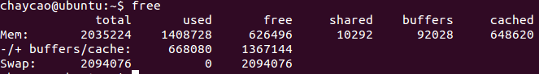

# free

相比top，提供更简洁的系统内存使用情况

## 参数说明

- Mem：表示物理内存统计
  - Total：表示物理内存总大小。
  - Used：表示总计分配给缓存（包含buffers 与cache ）使用的数量，但其中可能部分缓存并未实际使用。
  - Free：表示未被分配的内存。
  - Shared：共享内存，一般系统不会用到。
  - Buffers：系统分配但未被使用的buffers 数量。
  - Cached：系统分配但未被使用的cache 数量。
- -/+ buffers/cached：表示物理内存的缓存统计 
  - Used：实际使用的buffers 与cache 总量，也是实际使用的内存总量。
  - Free: 未被使用的buffers 与cache 和未被分配的内存之和，这就是系统当前实际可用内存。
- Swap：表示硬盘上交换分区的使用情况。只有mem被当前进程实际占用完,即没有了buffers和cache时，才会使用到swap。

1. 实际可用内存大小：

​       Free（-/+ buffers/cache行）= Free(Mem)+buffers(Mem)+Cached(Mem);

2.  已经分配的内存大小：

​       Used(Mem) = Used(-/+ buffers/cache)+ buffers(Mem) + Cached(Mem)

3. 物理内存总大小

​       total（Mem） = used(-/+ buffers/cache) + free(-/+ buffers/cache)

​                     1035108 = 471772 + 563336

## buffer 与 cache 的区别

A buffer is something that has yet to be "written" to disk.

A cache is something that has been "read" from the disk and stored for later use.

### cache

Cache：高速缓存，是位于CPU与主内存间的一种容量较小但速度很高的存储器。

由于CPU的速度远高于主内存，CPU直接从内存中存取数据要等待一定时间周期，Cache中保存着CPU刚用过或循环使用的一部分数据，当CPU再次使用该部分数据时可从Cache中直接调用,这样就减少了CPU的等待时间,提高了系统的效率。

Cache又分为一级Cache(L1 Cache)和二级Cache(L2 Cache)，L1 Cache集成在CPU内部，L2 Cache早期一般是焊在主板上,现在也都集成在CPU内部，常见的容量有256KB或512KB L2 Cache。

### buffer

Buffer：缓冲区，一个用于存储速度不同步的设备或优先级不同的设备之间传输数据的区域。通过缓冲区，可以使进程之间的相互等待变少，从而使从速度慢的设备读入数据时，速度快的设备的操作进程不发生间断。

### 比较

在Free命令中显示的buffer和cache，它们都是占用内存：

buffer : 作为buffer cache的内存，是块设备的读写缓冲区，更靠近存储设备，或者直接就是disk的缓冲区。

cache: 作为page cache的内存, 文件系统的cache，是memory的缓冲区

 

如果 cache 的值很大，说明cache住的文件数很多。如果频繁访问到的文件都能被cache住，那么磁盘的读IO 必会非常小。