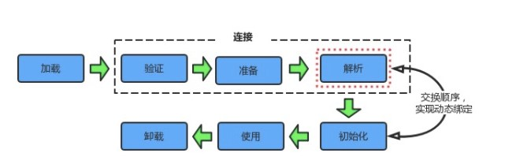

## 1. 内存泄露、内存溢出 

**内存泄露**：指不再使用的对象，被某个对象持有该引用导致GC不能回收。

**造成内存泄露的原因：**

1. **静态集合类**。如HashMap、Vector，生命周期与程序一致，则容器中的对象在程序结束之前不能被释放。
2. **连接资源未释放**。如数据库连接、网络连接、IO连接等，当不再使用时，需要调用close方法来释放连接，只有连接关闭，GC才能回收。
3. **变量不合理的作用域**。变量定义的作用范围大于其使用范围；没有及时的把对象设置为null。

**解决方案：**

1. 避免在循环中创建对象。
2. 尽早释放无用对象的引用。
3. 尽量少用静态变量。
4. 使用字符串处理，避免使用String，改为使用StringBuffer或StringBuilder。

**如何查找内存泄露？**

使用 Jconsole。

如果内存大小持续增长，则说明系统存在内存泄露。


**内存溢出**：程序运行过程中无法申请到足够的内存。

**内存溢出的几种情况（OOM）**：

1. 虚拟机栈和本地方法栈 溢出
2. 堆 溢出
3. 方法区 溢出
4. 运行时常量池 溢出

**导致内存溢出的原因：**

1. 内存中加载的数据量过大，如一次从数据库中加载过多数据
2. 集合类中有对象的引用，使用后未清空，不能被GC
3. 代码存在死循环或循环产生过多重复对象
4. 启动参数内存值设定过小

**解决办法：**

1. 修改JVM启动参数，直接增加内存
2. 检查错误日志
3. 使用内存查看工具动态查看内存使用情况
4. 对代码分析，找出可能内存溢出的地方


## 2. Java的垃圾回收机制

Java的垃圾回收机制使得程序员在编写代码时**不需要考虑内存管理**。垃圾回收器作为**守护线程**运行，在**不可预知的情况**下对内存堆中的对象进行清理的回收。程序员**不能实时的调用垃圾回收器**进行垃圾回收。可以手动执行**System.gc()**通知GC运行，但并不保证GC一定会执行。

垃圾回收器的机制可以从三个方面讲述

**（1）什么时候触发GC**

当新生代中的eden区满了，会触发minor gc；

进行minor gc时，survivor区升到老年代的平均对象大于老年代剩余空间会触发full gc，或者小于时HandlePromotionFailure参数为false，强制full gc。

**（2）哪些对象需要被回收**

从GC Roots搜索不到，而且经过第一次标记、清理后，仍然没有复活的对象。

**（3）如何回收**

对于新生代使用复制算法，将Eden和from surivor中还活着的对象一次性复制到to surivor中，再清理掉Eden和From Survior空间。

对于老年代使用标记清除或标记整理算法。标记清除首先标记出所有需要回收的对象，在标记完成后统一回收所有标记的对象，但是会产生大量不连续的内存碎片；标记整理的标记与标记清除相同，但不是直接回收对象，而是将所有存活的对象向一端移动，然后直接清理掉边界以外的内存 。


## 3. JVM内存分区

JVM内存被分为以下几个区域：

（1）程序计数器：记录当前线程执行字节码指令的地址

（2）虚拟机栈：当方法执行时，会创建一个栈帧，存放局部变量表、操作数栈、方法出口等信息。

（3）本地方法栈：Native方法执行时使用，与虚拟机栈类似

（4）虚拟机堆：所有创建的对象都在堆中分配内存并初始化

（5）方法区：存放虚拟机加载的类信息、常量、静态变量、JIT编译后的代码等信息

其中程序计数器、虚拟机栈、本地方法栈为线程私有。

**为什么要分为堆和栈？**

1. 逻辑清晰。栈表示逻辑，堆表示数据，各自有合适的内存管理方式，方便JVM调用和管理。
2. 数据交互。栈帧彼此独立，堆中内容被栈帧共享。


## 4. 四种引用的特点和使用场景

1. **强引用**（StrongReference）
   - 最普通的引用，垃圾回收器不会回收（内存不够也不会回收）
2. **软引用**（SoftReference）
   - 内存够不回收，内存不够则回收（可与引用队列ReferenceQueue联合使用）
   - 可用来实现内存敏感的高速缓存
3. **弱引用**（WeakReference）
   - 无论内存是否足够，都会被回收（可与引用队列ReferenceQueue联合使用）
   - 可用于Map中，引用占用空间较大的对象
4. **虚引用**（PhantomReference）
   - get方法不能获得指向对象，必须与引用队列ReferenceQueue联合使用
   - 用于跟踪垃圾回收过程 。当指向的对象回收后，被加入到引用队列，用作记录该引用指向的对象已被销毁。可用于在实现对象被回收前做清理操作，比finalize()更灵活 


**一个对象的引用类型有多个，如何判断它的可达性，规则（“单弱多强”）如下：**

1. **单条引用链**的可达性以**最弱**的一个引用类型来决定
2. **多条引用链**的可达性以**最强**的一个引用类型来决定


## 5. GC Roots

1. 虚拟机栈中引用的对象
2. 本地方法栈中引用的对象
3. 方法区中静态成员引用的对象
4. 方法区中常量引用的对象


## 6. 内存分配策略

1. **优先分配在Eden区**。如果Eden区空间不够，执行一次minor GC
2. **大对象直接进入老年代**。避免在Eden区和Survivor区之间发生大量内存拷贝
3. **长期存活对象进入老年代**。每经过一次minor GC，年龄加1，大于阈值（默认15），进入老年代
4. **动态判断对象的年龄**。Survivor区中相同年龄的所有对象大小大于Survivior空间的一半，则大于等于该年龄的对象直接进入老年代。
5. **空间分配担保**。每次进行minor GC，会计算Survivor区移至老年代的对象的平均大小。若这个值大于老年代的剩余大小则进行一次Full GC，如果小于，则检查HandlepromotionFailure设置，若为true则进行minor GC，若为false则Full GC。


## 7. 垃圾收集算法的原理和特点

[参考](../JVM/垃圾回收/垃圾回收.md)


## 8. 垃圾收集器有哪些？CMS、G1的特点

[参考](../JVM/垃圾回收/垃圾回收.md)

**CMS**（Concurrent Mark Sweep） 使用标记-清理算法，并发收集、低停顿

四个流程：初始标记、并发标记、重新标记、并发清除

缺点：吞吐量低、无法处理浮动垃圾、产生空间碎片


## 9. 减少GC的次数

1. 对象不用时，最好显示置为null
2. 少用system.gc()
3. 少用静态变量
4. 使用StringBuffer或StringBuilder，而不用String做字符串处理
5. 分散对象创建或删除的时间
6. 少用finalize函数
7. 文件（如图片）可使用软引用类型
8. 能用基本类型int、long，就不用包装类Integer、Long
9. 增大-xmx


## 10. JVM常见启动参数

- **-Xms**：设置堆的最小值
- **-Xmx**：设置堆的最大值
- **-Xmn**：设置新生代的大小
- **-Xss**：设置每个线程的栈大小
- **-XX:NewSize**：设置新生代的初始值
- **-XX:MaxNewSize**：设置新生代的最大值
- **-XX:PermSize**：设置永久代的初始值
- **-XX:MaxPermSize**：设置永久代的最大值
- **-XX:SurvivorRatio**：设置新生代中Eden区和Survivor区的大小比值
- **-XX:PretenureSizeThreshold**：大于该值，直接分配在老年代


## 11. 常用内存调试工具

- **jps** ：查看虚拟机进程情况，如进程ID
- **jmap** ：用于生成堆转储快照文件（某一时刻）
- **jhat** ：对生成的对转储快照文件进行分析
- **jstack** ：用来生成线程快照（某一时刻）。用于定位线程长时停顿的原因（如死锁、死循环、等待IO）
- **jstate** ：虚拟机统计信息监视工具。如显示垃圾收集的情况，内存使用的情况。
- **jconsole** ：内存监控，线程监控


## 12. 类加载机制

Java中类是在运行时动态加载的。

**一、类的生命周期**

包括7个阶段：



- **加载**
- **验证**
- **准备**
- **解析**
- **初始化**
- 使用
- 卸载

其中解析过程在某些情况下可以在初始化阶段之后再开始，这是为了支持 Java 的动态绑定。

**二、类初始化时机**

虚拟机规范中并没有强制约束何时进行加载，但是规范严格规定了有且只有下列五种情况必须对类进行初始化（加载、验证、准备都会随之发生）：

- **遇到 new、getstatic、putstatic、invokestatic 这四条字节码指令时**，如果类没有进行过初始化，则必须先触发其初始化。最常见的生成这 4 条指令的场景是：使用 new 关键字实例化对象的时候；读取或设置一个类的静态字段（被 final 修饰、已在编译期把结果放入常量池的静态字段除外）的时候；以及调用一个类的静态方法的时候。
- **使用 java.lang.reflect 包的方法对类进行反射调用的时候**，如果类没有进行初始化，则需要先触发其初始化。
- **当初始化一个类的时候，如果发现其父类还没有进行过初始化**，则需要先触发其父类的初始化。
- 当虚拟机启动时，用户需要指定一个要执行的主类（包含 **main() 方法的那个类**），虚拟机会先初始化这个主类；
- 当使用 JDK 1.7 的动态语言支持时，如果一个 **java.lang.invoke.MethodHandle 实例最后的解析结果为 REF_getStatic, REF_putStatic, REF_invokeStatic 的方法句柄，并且这个方法句柄所对应的类没有进行过初始化**，则需要先触发其初始化；

以上 5 种场景中的行为称为对一个类进行主动引用。除此之外，所有引用类的方式都不会触发初始化，称为被动引用。被动引用的常见例子包括：

- 通过子类引用父类的静态字段，不会导致子类初始化。

```java
System.out.println(SubClass.value);  // value 字段在 SuperClass 中定义
```

- 通过数组定义来引用类，不会触发此类的初始化。该过程会对数组类进行初始化，数组类是一个由虚拟机自动生成的、直接继承自 Object 的子类，其中包含了数组的属性和方法。

```java
SuperClass[] sca = new SuperClass[10];
```

- 常量在编译阶段会存入调用类的常量池中，本质上并没有直接引用到定义常量的类，因此不会触发定义常量的类的初始化。

```java
System.out.println(ConstClass.HELLOWORLD);
```


**三、类加载过程**

包含了加载、验证、准备、解析和初始化这 5 个阶段。

1. **加载**

加载是类加载的一个阶段，注意不要混淆。

加载过程完成以下三件事：

- **通过一个类的全限定名来获取定义此类的二进制字节流。**
- **将这个字节流所代表的静态存储结构转化为方法区的运行时存储结构。**
- **在内存中生成一个代表这个类的 Class 对象，作为方法区这个类的各种数据的访问入口。**

其中二进制字节流可以从以下方式中获取：

- 从 ZIP 包读取，这很常见，最终成为日后 JAR、EAR、WAR 格式的基础。
- 从网络中获取，这种场景最典型的应用是 Applet。
- 运行时计算生成，这种场景使用得最多得就是动态代理技术，在 java.lang.reflect.Proxy 中，就是用了 ProxyGenerator.generateProxyClass 的代理类的二进制字节流。
- 由其他文件生成，典型场景是 JSP 应用，即由 JSP 文件生成对应的 Class 类。
- 从数据库读取，这种场景相对少见，例如有些中间件服务器（如 SAP Netweaver）可以选择把程序安装到数据库中来完成程序代码在集群间的分发。 ...

2. **验证**

**确保 Class 文件的字节流中包含的信息符合当前虚拟机的要求，并且不会危害虚拟机自身的安全。**

- 文件格式验证：验证字节流是否符合 Class 文件格式的规范，并且能被当前版本的虚拟机处理。
- 元数据验证：对字节码描述的信息进行语义分析，以保证其描述的信息符合 Java 语言规范的要求。
- 字节码验证：通过数据流和控制流分析，确保程序语义是合法、符合逻辑的。
- 符号引用验证：发生在虚拟机将符号引用转换为直接引用的时候，对类自身以外（常量池中的各种符号引用）的信息进行匹配性校验。

3. **准备**

类变量是被 static 修饰的变量，**准备阶段为类变量分配内存并设置初始值，使用的是方法区的内存**。

实例变量不会在这阶段分配内存，它将会在对象实例化时随着对象一起分配在 Java 堆中。（实例化不是类加载的一个过程，类加载发生在所有实例化操作之前，并且类加载只进行一次，实例化可以进行多次）

初始值一般为 0 值，例如下面的类变量 value 被初始化为 0 而不是 123。

```java
public static int value = 123;
```

如果类变量是常量，那么会按照表达式来进行初始化，而不是赋值为 0。

```java
public static final int value = 123;
```

4. **解析**

**将常量池的符号引用替换为直接引用的过程。**

5. **初始化**

初始化阶段才真正开始执行类中的定义的 Java 程序代码。**初始化阶段即虚拟机执行类构造器 <clinit>() 方法的过程**。

在准备阶段，类变量已经赋过一次系统要求的初始值，而在初始化阶段，根据程序员通过程序制定的主观计划去初始化类变量和其它资源。

<clinit>() 方法具有以下特点：

- 是由编译器自动收集类中所有类变量的赋值动作和静态语句块（static{} 块）中的语句合并产生的，编译器收集的顺序由语句在源文件中出现的顺序决定。特别注意的是，静态语句块只能访问到定义在它之前的类变量，定义在它之后的类变量只能赋值，不能访问。例如以下代码：

```java
public class Test {
    static {
        i = 0;                // 给变量赋值可以正常编译通过
        System.out.print(i);  // 这句编译器会提示“非法向前引用”
    }
    static int i = 1;
}
```

- 与类的构造函数（或者说实例构造器 <init>()）不同，不需要显式的调用父类的构造器。**虚拟机会自动保证在子类的 <clinit>() 方法运行之前，父类的 <clinit>() 方法已经执行结束**。因此虚拟机中第一个执行 <clinit>() 方法的类肯定为 java.lang.Object。
- 由于父类的 <clinit>() 方法先执行，也就意味着父类中定义的静态语句块要优于子类的变量赋值操作。例如以下代码：

```java
static class Parent {
    public static int A = 1;
    static {
        A = 2;
    }
}

static class Sub extends Parent {
    public static int B = A;
}

public static void main(String[] args) {
     System.out.println(Sub.B);  // 输出结果是父类中的静态变量 A 的值，也就是 2。
}
```

- <clinit>() 方法对于类或接口不是必须的，如果一个类中不包含静态语句块，也没有对类变量的赋值操作，编译器可以不为该类生成 <clinit>() 方法。
- 接口中不可以使用静态语句块，但仍然有类变量初始化的赋值操作，因此接口与类一样都会生成 <clinit>() 方法。但接口与类不同的是，**执行接口的 <clinit>() 方法不需要先执行父接口的 <clinit>() 方法。只有当父接口中定义的变量使用时，父接口才会初始化。另外，接口的实现类在初始化时也一样不会执行接口的 <clinit>() 方法**。
- 虚拟机会保证一个类的 <clinit>() 方法在多线程环境下被正确的加锁和同步，如果多个线程同时初始化一个类，只会有一个线程执行这个类的 <clinit>() 方法，其它线程都会阻塞等待，直到活动线程执行 <clinit>() 方法完毕。如果在一个类的 <clinit>() 方法中有耗时的操作，就可能造成多个线程阻塞，在实际过程中此种阻塞很隐蔽。


**四、类加载器**

**作用**：运行时加载类

**三个机制**：委托性、可见性和单一性

1. 委托性：双亲委派模型
2. 可见性：子类的加载器可以看见所有的父类加载器加载的类，而父类加载器看不到子类加载器加载的类
3. 单一性：仅加载一个类一次，由委托机制确保子类加载器不会再加载父类加载器加载过的类

**分类**：

从JVM角度：

- 启动类加载器，由C++实现，是虚拟机自身的一部分
- 其他类加载器，由Java实现，独立与虚拟机外部，继承自java.lang.ClassLoader

从开发人员角度：

- **启动类加载器**（Bootstrap ClassLoader） ：**此类加载器负责将存放在 <JAVA_HOME>\lib 目录中的，或者被 -Xbootclasspath 参数所指定的路径中的，并且是虚拟机识别的（仅按照文件名识别，如 rt.jar，名字不符合的类库即使放在 lib 目录中也不会被加载）类库加载到虚拟机内存中**。启动类加载器无法被 Java 程序直接引用，用户在编写自定义类加载器时，如果需要把加载请求委派给启动类加载器，直接使用 null 代替即可。 
- **扩展类加载器**（Extension ClassLoader）这个类加载器是由ExtClassLoader（sun.misc.Launcher$ExtClassLoader）实现的。它**负责将 <JAVA_HOME>/lib/ext 或者被 java.ext.dir 系统变量所指定路径中的所有类库加载到内存中**，开发者可以直接使用扩展类加载器。 
- **应用程序类加载器**（Application ClassLoader）这个类加载器是由 AppClassLoader（sun.misc.Launcher$AppClassLoader）实现的。由于这个类加载器是 ClassLoader 中的 getSystemClassLoader() 方法的返回值，因此一般称为系统类加载器。它**负责加载用户类路径（ClassPath）上所指定的类库**，开发者可以直接使用这个类加载器，如果应用程序中没有自定义过自己的类加载器，一般情况下这个就是程序中默认的类加载器。 

**双亲委派模型：**

- 双亲委派模型指的是类加载器之间的层次关系，要求除了顶层的启动类加载器外，其余的加载器都应有自己的父类加载器，这里的父子关系是使用组合关系。

- 工作过程：当一个类加载器收到加载类的请求，首先会将请求委派给父类加载器完成，最终传送到顶层的启动类加载器，只有当父加载器反馈无法完成这个加载请求时，子加载器才会尝试自己加载。
- 优点：提高安全性，使Java类随着类加载器具备带有优先级的层次关系。在该机制下，用户自定义的类加载器不可能加载本应由父加载器加载的类。

**如何自定义类加载器：**

继承ClassLoader类，重写findClass()方法

**如何打破双亲委派机制：**

继承ClassLoader类，重写findClass()、loadClass()方法