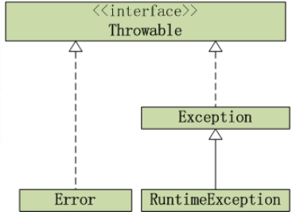

## 1. HashMap什么情况下发生死链 

JDK1.8之前，并发resize()的时候可能会发生死链。

[参考](https://coolshell.cn/articles/9606.html)

## 2. HashMap

**HashMap的特性？**

HashMap 存储键值对，实现快速存取数据；允许null键\值；非同步；不保证有序

**HashMap的原理，内部数据结构？**

基于hashing的原理，jdk1.8之前底层使用哈希表（数组+链表）实现。jdk1.8之后，当链表长度大于8时，将链表转换成红黑树。

HashMap中的最重要两个方法put、get

put方法的原理：传入k，v，通过取hashcode，高位参与运算、取模运算三步，获得bucket位置，进行存储，如果没有碰撞直接放bucket里，如果碰撞，以链表形式存在buctets后，如果节点已经存在就替换oldvalue。当hashmap的bucket占用情况超过capacity*load_factor则，通过resize方法扩容为2倍。

get方法的原理：传入k，通过取hashcode，高位参与运算、取模运算三步，获得bucket位置，并进一步调用equals方法确定键值对。

**当两个对象的hashcode相同会发生什么？**

若两个对象的hashcode相同，则他们的bucket位置相同，会发生碰撞。

**有哪些hash的实现方式？**

- 直接定址法：取k的某个线性函数值为散列地址。
- 数字分析法：提取关键字k中取值比较均匀的数字作为哈希地址。例如，生日使用月份和日期构成散列地址。
- 除留余数法：用关键字k除以某个不大于哈希表长度m的数p，将所得余数作为哈希表地址。
- 分段叠加法：按照哈希表地址位数将关键字分成位数相等的几部分，其中最后一部分可以比较短。然后将这几部分相加，舍弃最高进位后的结果就是该关键字的哈希地址。
- 平方取中法：如果关键字各个部分分布都不均匀的话，可以先求出它的平方值，然后按照需求取中间的几位作为哈希地址。
- 伪随机数法：采用一个伪随机数当作哈希函数。

**有哪些hash冲突解决办法？**

- 开放地址法：一旦发生了冲突，就去寻找下一个空的散列地址，只要散列表足够大，空的散列地址总能找到，并将记录存入。
- 链地址法：将哈希表的每个单元作为链表的头结点，所有哈希地址为i的元素构成一个链表。即发生冲突时就把该关键字链在以该单元为头结点的链表的尾部。
- 再哈希法：当哈希地址发生冲突用其他的函数计算另一个哈希函数地址，直到冲突不再产生为止。
- 建立公共溢出表：将哈希表分为基本表和溢出表两部分，发生冲突的元素都放入溢出表中。

**为什么String、Integer适合作为键？**

- 已重写了equals()和hashCode()。（让不相等的对象返回不同的hashcode值）
- 具有不可变性，可防止键值的改变，线程安全 

**HashMap与HashTable区别？**

1. 线程安全性。HashTable中几乎所有函数是同步的，所以它是线程安全的。HashMap是线程不安全的。
2. NULL值。HashMap的key、value都可为null，Hashtable都不可为null
3. 容器的初始值和扩容方式。HashMap默认16，扩容 （原始容量*2）,；HashTable默认11，扩容 （原始容量 * 2+1）
4. HashMap继承于AbstractMap，HashTable继承于Dictionary
5. hash算法。HashMap自定义的哈希算法；HashTable直接采用key的hashCode()；
6. 速度。单线程环境下HashMap更快

**让HashMap同步**

Collections.synchronizeMap()


## 3. 多线程顺序执行 

（1） 有A、B、C、D四个线程，A线程输出A, B线程输出B, C线程输出C，D线程输出D，要求, 同时启动四个线程, 按顺序输出ABCD 

答：通过Thread.join()方法，B、C、D分别持有A、B、C的引用，并且在输出前调用持有线程的join方法，等待线程执行完毕，再输出。

```java
package thread;

public class TestThread1 {

    public static void main(String[] args) {

        // 线程A
        final Thread a = new Thread(new Runnable() {
            @Override
            public void run() {
                System.out.println("A");
            }
        });

        // 线程B
        final Thread b = new Thread(new Runnable() {
            @Override
            public void run() {
                try {
                    // 执行b线程之前，加入a线程,让a线程执行
                    a.join();
                } catch (InterruptedException e) {
                    e.printStackTrace();
                }
                System.out.println("B");
            }
        });

        // 线程C
        final Thread c = new Thread(new Runnable() {
            @Override
            public void run() {
                try {
                    // 执行c线程之前，加入b线程,让b线程执行
                    b.join();
                } catch (InterruptedException e) {
                    e.printStackTrace();
                }
                System.out.println("C");
            }
        });

        // 线程D
        Thread d = new Thread(new Runnable() {
            @Override
            public void run() {
                try {
                    // 执行d线程之前，加入c线程,让c线程执行
                    c.join();
                } catch (InterruptedException e) {
                    e.printStackTrace();
                }
                System.out.println("D");
            }
        });

        // 启动四个线程
        a.start();
        b.start();
        c.start();
        d.start();

    }

}
```

（2） 有A,B,C三个线程, A线程输出A, B线程输出B, C线程输出C。要求, 同时启动三个线程, 按顺序输出ABC, 循环10次 

使用ReentrantLock控制并发,并使用一个state整数来判断应哪个线程执行。 

```java
public class Test {
    private static ReentrantLock lock = new ReentrantLock();
    private static int state = 0;
    
    static class A extend Thread() {
        @Override
        public void run() {
            lock.lock();
            for (int i = 0; i < 10;) {
                if (state%3 == 0) {
                    System.out.println("A");
                }
                i++;
                state++;
            }
            lock.unlock();    
        }        
    }
    
    static class B extend Thread() {
        @Override
        public void run() {
            lock.lock();
            for (int i = 0; i < 10;) {
                if (state%3 == 1) {
                    System.out.println("B");
                }
                i++;
                state++;
            }
            lock.unlock();    
        }        
    }    
    
    static class C extend Thread() {
        @Override
        public void run() {
            lock.lock();
            for (int i = 0; i < 10;) {
                if (state%3 == 2) {
                    System.out.println("C");
                }
                i++;
                state++;
            }
            lock.unlock();    
        }        
    }
    
    public static void main(String[] args) {
        new A().start();
        new B().start();
        new C().start();
    }
}

```


## 4. hashCode()与equals()

equals()方法用来判断两个对象是否相等，Object默认比较对象地址

hashCode()方法用来获取哈希码，Object默认根据对象地址转换成一个整数

**为什么重写equals()一定要重写hashCode()方法**

这是因为HashMap等哈希表是由hashcode()定位要存放的位置，而equals()判断是否相等，这意味着逻辑上equals()相等，认为这两个对象相等则应该放在同一个桶中，所以hashcode()也需要相等。 

**hashCode的作用**

用于查找，在HashMap、HashTable等散列表中用hashCode确定对象的存储地址。


## 5. Java内存模型

Java内存模型（JMM）是一种虚拟机规范，定义了多线程之间共享变量的可见性。采用的是共享内存模型，**线程之间的共享变量存储在主内存中，每个线程都有一个私有的本地内存，本地内存中存储了该线程读\写共享变量的副本**。


## 6. Object的公用方法

- toString()
- equals()
- hashCode()
- wait()、notify()、notifyAll()
- clone()
- getClass()
- finalize()


## 7. String、StringBuffer、StringBuilder

- **String**：不可变对象，每次改变相当于生成新的String对象
- **StringBuffer**：可变对象，线程安全
- **StringBuilder**：可变对象，线程不安全，速度比StringBuffer快


## 8. 创建对象的方式

1. 用 new 语句创建对象
2. 反射，调用 java.lang.Class 或 java.lang.reflect.Constructor 类的 newInstance() 实例方法
3. 调用对象的 clone() 方法
4. 反序列化，通过 java.io.ObjectInputStream 对象的 readObject() 方法

1、2会调用构造函数

3 是在内存上对已有对象的影印，不会调用构造函数

4 是从文件中还原，不会调用构造函数


## 9. try里有return，finally是否执行

会执行，在return表达式之后执行，返回之前执行

finally里的修改语句可能影响也可能不影响try或catch中 return已经确定的返回值，若finally里也有return语句则覆盖try或catch中的return语句直接返回。 

[参考](http://www.cnblogs.com/lanxuezaipiao/p/3440471.html)


## 10. Exception与Error的结构




## 11. Java面向对象的三个特征和含义

**封装**：**把数据和方法绑定起来，对数据的访问只能通过已定义的接口**，也就是隐藏一切可隐藏的东西，只向外界提供最简单的编程接口Java的四种访问控制符：public，default，protected，private 

**继承**：**从已有类得到继承信息创建新类的过程**。提供继承信息的类称为父类；得到继承信息的类称为子类继承使变化中的软件系统具有一定的延续性，同时继承使封装程序中具有扩展性Java中的extends（用于基本类和抽象类）和implements（用于接口），extends单继承，implements不限 

**多态**：**允许不同子类型的对象对同一消息做出不同响应**，也就是用同样的对象引用调用同样的方法但做了不同的事。分为

- 编译时多态：方法重载（overload，用于一个类内实现若干重载的方法，这些方法名称相同而参数形式不同）
- 运行时多态：方法重写（覆盖，override，用于子类继承父类时，重新实现父类中的方法） 


## 12. Interface 与 Abstart 的区别

两者的特性：

- 抽象类：用来捕捉子类的通用特性。不能被实例化，只能作为子类的超类，被用来创建继承层级里子类的模板
- 接口：抽象方法的集合，像契约模式，若实现该接口，则必须确保使用接口中的方法对比： 

| 参数         |                          抽象类                           | 接口                                       |
| ------------ | :-------------------------------------------------------: | ------------------------------------------ |
| 默认方法实现 |                           可以                            | 不可以                                     |
| 实现         | extends关键字。若子类不是抽象类，需提供所有声明方法的实现 | implements关键字。需提供所有声明方法的实现 |
| 构造器       |                          可以有                           | 可以有                                     |
| 访问修饰符   |            public、protected、default、private            | 默认public不可以其他                       |
| main方法     |                          可以有                           | 不可以                                     |


## 13. 静态内部类 与 非静态内部类 区别

- 静态内部类：不需要有指向外部类对象的引用；可以访问静态成员
- 非静态内部类：需要有指向外部类对象的引用；可以访问静态成员和非静态成员； 


## 14. 多态的实现原理

[参考](../JavaSE/语法/多态.md)


## 15. ThreadLocal的设计理念和作用

[参考](../JavaSE/并发/ThreadLocal.md)


## 16. foreach

效率 还是得看普通for里的具体操作

对于ArrayList，普通for快一点，减少了“解除语法糖”的操作

对于LinkedList，linkedlist.get(）每次都从头开始了，foreach就快很多，

foreach能使用的类型：数组、java.lang.Iterable

- 数组：转化为对数组中每个元素的循环引用
- Iterable接口，调用next()、hasNext()方法做循环遍历


## 17. 反射的实现原理

[参考](../JavaSE/语法/反射.md)


## 18. synchronized

synchronized 是Java中的关键字，可以控制多线程对共享资源的访问。在Java中每一个对象都可以作为锁

当synchronized作用于以下三种情况：

- 对于普通同步方法，锁是当前实例对象
- 对于静态同步方法，锁是当前类的Class对象
- 对于同步方法块，锁是Synchronized括号里配置的对象

**实现原理**：

JVM 基于进入和退出 Monitor 对象来实现方法同步、代码块同步

代码块同步：使用 monitorenter、monitorexit 指令实现

方法同步：方法调用指令读取运行时常量池中方法的 ACC_SYNCHRONIZED 标志辨别是否为同步方法


## 19. Socket 编程

服务端：

1. 构建一个 ServerSocket 实例，指定本地端口，该 socket监听指定端口的连接请求
2. 重复以下步骤：
   1. 调用 accept() 方法获得客户端的连接请求，通过 accept() 方法返回的 socket 实例，建立一个和客户端的新连接
   2. 通过返回的 socket 实例获取 InputStream 和 OutputStream 来读写数据
   3. 通过 close() 方法关闭 socket 连接

客户端：

1. 构建 Socket 实例，通过制定的远程服务器和端口建立连接
2. 通过 Socket 实例包含的 InputStream 和 OutputStream 来进行数据的读写
3. 操作结束调用 socket 实例的 close 方法。