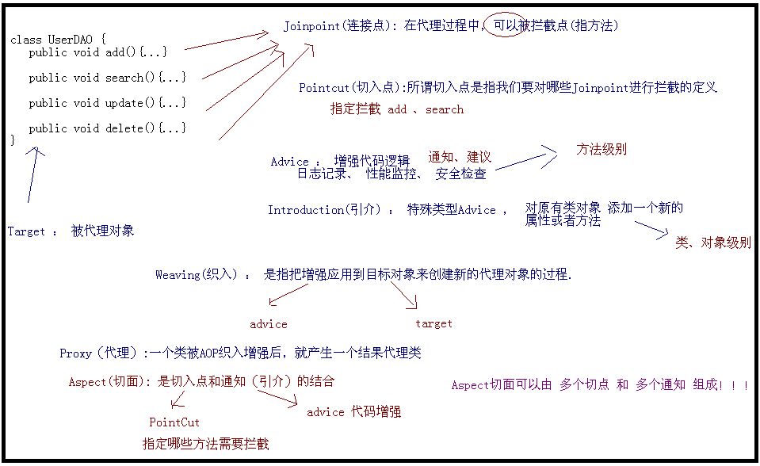

## 1. IOC 和 DI

IOC，控制反转，将原本在程序中手动创建对象的控制权，交由Spring框架管理。

DI，依赖注入，在Spring框架负责创建Bean对象时，动态的将依赖对象注入到Bean组件 。

Spring中依赖注入有三种方式：

1. 构造器注入
2. setter方法注入
3. 注解注入


## 2. BeanFactory 接口和 ApplicationContext 接口

ApplicationContext 是BeanFactory的子接口。

Spring核心工厂是BeanFactory，**BeanFactory采取延迟加载**，第一次getBean时才会初始化Bean。 **ApplicationContext是会在加载配置文件时初始化Bean**。

**ApplicationContext是对BeanFactory扩展，它可以进行国际化处理、事件传递和bean自动装配以及各种不同应用层的Context实现**。

开发中基本都在使用ApplicationContext, web项目使用WebApplicationContext ，很少用到BeanFactory。


## 3. bean实例化的三种方式

XML 配置中实例化 bean 的三种方式：

1. **普通构造方法**

   ```xml
   <bean class="org.sang.User" id="user"/>
   ```

2. **静态工厂**

   ```xml
   <bean id="user2" class="org.sang.User2Factory" factory-method="getInstance"/>
   ```

3. **实例工厂**

   ```xml
   <bean class="org.sang.User3Factory" id="user3Factory"/>
   <bean id="user3" factory-bean="user3Factory" factory-method="getUser3"/>
   ```

   

## 4. bean的生命周期和作用域

对于 prototype 作用域的 Bean，Spring容器仅负责创建，当容器创建 Bean 实例后，Bean 实例由客户端代码管理，容器不再跟踪其生命周期。即 **Spring 无法管理 prototype 作用域的 Bean**。

对于 singleton 作用域的 Bean，客户端代码不能控制 Bean 的销毁，Spring 容器负责跟踪 Bean 实例的产生、销毁。容器知道 Bean 何时实例化结束、何时销毁，**Spring 可以管理 Singleton 作用域的 Bean 实例化结束之后和销毁之前的行为**。

---

**Spring中Bean的生命周期**：

1. 实例化一个Bean（new）

2. 按照Spring上下文对实例化的Bean进行配置，IOC注入

3. 若实现 BeanNameAware 接口，会调用 setBeanName(String) 方法，传入配置文件中的Bean的 id 值

4. 若实现 BeanFactoryAware 接口，会调用 setBeanFactory(BeanFactory) 方法，传入Spring上下文

5. 若实现 ApplicationContextAware 接口，会调用 setApplicationContext(ApplicationContext) 方法，传入Spring上下文

6. 若关联 BeanPostProcessor 接口，将会调用 postProcessBeforeInitialization(Object obj, String s) 方法

7. 若配置了 init-method 属性会自动调用其配置的初始化方法

8. 若关联 BeanPostProcessor 接口，将会调用 postProcessAfterInitialization(Object obj, String s) 方法

   以上工作完成后，可以使用该Bean

9. 当Bean不再使用时，进入清理阶段，若实现了 DisposableBean接口，调用 destroy() 方法

10. 若配置了 destory-method 属性，会自动调用其配置的销毁方法


---

**作用域：**

1. singleton：默认，容器内只会一个 bean 的实例
2. prototype：为每一个请求提供一个实例
3. request：在一次HTTP请求中，一个bean定义对应一个实例；即每次HTTP请求将会有各自的bean实例， 它们依据某个bean定义创建而成。该作用 域仅在基于web的Spring ApplicationContext情形下有效。 
4. session：在一个HTTP Session中，一个bean定义对应一个实例。该作用域仅在基于web的Spring ApplicationContext情形下有效。
5. global session：在一个全局的HTTP Session中，一个bean定义对应一个实例。典型情况下，仅在使用portlet context的时候有效。该作用域仅在基于 web的Spring ApplicationContext情形下有效。 


## 5. AOP 实现原理

AOP，面向切面编程，作为面向对象的一种补充，用于处理系统中分布于各个模块的横切关注点，比如事务管理、日志、缓存等等

**AOP 的关键在于AOP框架自动创建的AOP代理**。

AOP代理分为**静态代理**、**动态代理**。

AspectJ 为 静态代理，Spring AOP 为动态代理。

---

**AspectJ**

静态代理，在编译阶段生成AOP代理，也称编译时增强。

在编译阶段将Aspect织入Java字节码中，运行的时候就是经过增强之后的AOP对象。

---

**Spring AOP**

动态代理，不会修改字节码，而是在内存中临时为方法生成一个AOP对象，该AOP对象包含了目标对象的全部方法，并在特定的切点做了增强处理，并回调原对象的方法。

有两种方式：

- **JDK动态代理**：通过反射来接收被代理的类，并要求被代理的类必须实现一个接口。核心是 InvocationHandler接口 和 Proxy 类。
- **CGLIB（Code Generation Libary）动态代理**：若目标类没有实现接口，则使用CGLIB来动态代理目标类。CGLIB是一个代码生成的类库，可以在运行时动态的生产某个类的子类，由于CGLIB通过继承的方式，所以如果某个类被标记为final，则无法使用CGLIB做动态代理


## 6. 事务管理

**事务**是对一系列的数据库操作进行统一的提交或回滚操作，如果插入成功，那么一起成功，如果中间有一条出现异常，那么回滚之前的所有操作。

**Spring 事务管理的API** ：

- TransactionDefinition：给定的事务规则
- PlatformTransactionManager：按照...来执行提交或回滚操作
- TransactionStatus：表示事务本身，可提交、回滚


Spring中事务支持两种模式：编程式事务、声明式事务

**编程式事务**

通过Spring提供的事务管理API，在代码中灵活控制事务的执行。在底层，Spring 仍然将事务操作委托给底层的持久化框架来执行。 

1. 基于底层API的编程式事务

```java
public class BankServiceImpl implements BankService {
    private BankDao bankDao;
    private TransactionDefinition txDefinition;
    private PlatformTransactionManager txManager;
    ......

    public boolean transfer(Long fromId， Long toId， double amount) {
        // 获取一个事务
        TransactionStatus txStatus = txManager.getTransaction(txDefinition);
        boolean result = false;
        try {
            result = bankDao.transfer(fromId， toId， amount);
            txManager.commit(txStatus);    // 事务提交
        } catch (Exception e) {
            result = false;
            txManager.rollback(txStatus);      // 事务回滚
            System.out.println("Transfer Error!");
        }
        return result;
    }
}
```

相应的配置文件

```xml
<bean id="bankService" class="footmark.spring.core.tx.programmatic.origin.BankServiceImpl">
    <property name="bankDao" ref="bankDao"/>
    <property name="txManager" ref="transactionManager"/>
    <property name="txDefinition">
    <bean class="org.springframework.transaction.support.DefaultTransactionDefinition">
    	<property name="propagationBehaviorName" value="PROPAGATION_REQUIRED"/>
    </bean>
    </property>
</bean>
```

2. 基于 TransactionTemplate 的编程式事务管理 

```java
public class BankServiceImpl implements BankService {
    private BankDao bankDao;
    private TransactionTemplate transactionTemplate;
    ......
    public boolean transfer(final Long fromId， final Long toId， final double amount) {
    	return (Boolean) transactionTemplate.execute(new TransactionCallback(){
    		public Object doInTransaction(TransactionStatus status) {
    			Object result;
            try {
            	result = bankDao.transfer(fromId， toId， amount);
            } catch (Exception e) {
            status.setRollbackOnly();
            result = false;
            System.out.println("Transfer Error!");
	    	}
    		return result;
    	}
    });
    }
}
}}
```


**声明式事务**

Spring 的声明式事务管理是**建立在 Spring AOP 机制之上**的，其本质是**对目标方法前后进行拦截，并在目标方法开始之前创建或者加入一个事务，在执行完目标方法之后根据执行情况提交或者回滚事务**。 

声明式事务得益于 Spring IoC容器 和 Spring AOP 机制的支持：IoC容器为声明式事务管理提供了基础设施，使得 Bean 对于 Spring 框架而言是可管理的；而由于事务管理本身就是一个典型的横切逻辑（正是 AOP 的用武之地） 

**优点**：不需要通过编程的方式管理事务，不需要在业务逻辑代码中掺杂事务管理的代码，只需在配置文件中作相关的事务规则声明（或通过等价的基于标注的方式），便可以将事务规则应用到业务逻辑中 


## 7. 事务传播

**为什么有事务传播？**

因为在实际开发中，业务层方法间相互调用

**7种事务传播级别**

- PROPAGATION_REQUIRED–支持当前事务，如果当前没有事务，就新建一个事务。这是最常见的选择
- PROPAGATION_SUPPORTS–支持当前事务，如果当前没有事务，就以非事务方式执行
- PROPAGATION_MANDATORY–支持当前事务，如果当前没有事务，就抛出异常
- PROPAGATION_REQUIRES_NEW–新建事务，如果当前存在事务，把当前事务挂起
- PROPAGATION_NOT_SUPPORTED–以非事务方式执行操作，如果当前存在事务，就把当前事务挂起
- PROPAGATION_NEVER–以非事务方式执行，如果当前存在事务，则抛出异常。
- PROPAGATION_NESTED–如果当前存在事务，则在嵌套事务内执行。如果当前没有事务，则进行与 PROPAGATION_REQUIRED类似的操作。 


## 8. AOP中的名词




## 9. 通知（Advice）有哪些类型

1. **前置通知（Before Advice）**：在某连接点之前执行的通知。
2. **返回后通知（After Returning Advice）**：在某连接点正常完成后执行的通知。
3. **抛出异常后通知（After Throwing Advice）**：在方法抛出异常退出时执行的通知。
4. **后通知（After (finally) Advice）**：当某连接点退出的时候执行的通知
5. **环绕通知（Around Advice）**：包围一个连接点的通知，如方法调用。


## 10. Spring如何处理线程并发问题

使用ThreadLocal解决线程安全问题

对于Singleton的Bean，采用ThreadLocal进行处理，为每一个线程提供一个独立的变量副本，隔离多个线程对数据的访问冲突。


**参考：**

- [Spring事务管理机制概述](https://blog.csdn.net/justloveyou_/article/details/73733278)


## 11. 循环依赖

循环依赖：N个类中循环嵌套使用

**第一种：构造器注入，参数循环依赖**

Spring容器将每一个正在创建的Bean标志符放在一个“当前创建Bean池”中，若在创建过程中，发现自己已经在“当前创建Bean池”里，会抛出 BeanCurrentlyInCreationException 异常，表示循环依赖。

对于创建完毕的Bean将从“当前创建Bean池”中清除掉。

**第二种：setter注入，单例，默认方式**


从图中可得知，Spring是先将 Bean 对象实例化后再设置对象属性的。

因此不会出现循环的问题

**第三种：setter注入，原型，prototype**

```xml
<bean id="a" class="com.zfx.student.StudentA" scope="prototype">
    <property name="studentB" ref="b"></property>
</bean>
<bean id="b" class="com.zfx.student.StudentB" scope="prototype">
    <property name="studentC" ref="c"></property>
</bean>
<bean id="c" class="com.zfx.student.StudentC" scope="prototype">
    <property name="studentA" ref="a"></property>
</bean>
```
对于“prototype”作用域Bean，Spring容器无法完成依赖注入，因为“prototype”作用域的Bean，Spring容器不进行缓存，因此无法提前暴露一个创建中的Bean。


## 12. Spring是什么，优缺点

Spring是一个DI和AOP容器框架。

作为容器，包含并管理应用对象的生命周期和配置，如对象的创建、销毁、回调等。

作为框架，提供一些基础功能，如事务管理、持久层集成等。

**优点**：

1. IOC容器，将对象的依赖关系交给Spring，降低组件之间的耦合性
2. 提供事务管理等服务
3. 支持AOP
4. 对主流框架提供集成支持，如Hibernate等
5. DI机制，降低了业务对象替换的复杂性
6. 低侵入性


## 13. Bean的成员变量

1. 普通属性值：<value> 123 <value/>，基本类型及其包装类、字符串类型
2. 引用Bean：<ref bean="A"/>，容器中的另一个Bean实例
3. 嵌套Bean：<bean class="com.chaycao.B"/>，容器不能获得嵌套Bean
4. 集合值：<list/>、<set/>、<map/>、<props/>分别设置List、Set、Map、Properties的集合参数值