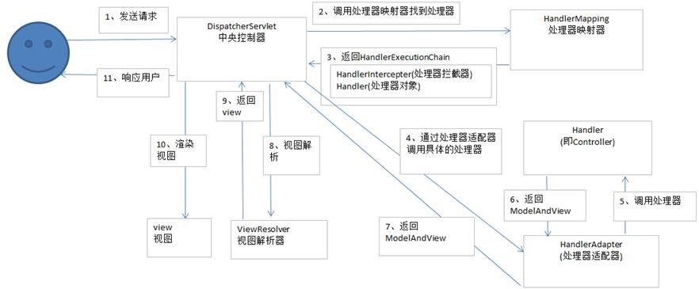

## 1. SpringMVC的工作流程

（1）用户发送请求到DispatcherServlet

（2）DispatcherServlet收到请求后调用HandlerMapping

（3）HandlerMapping根据请求的URL找到具体的处理器，生成处理器对象及处理器拦截器，返回给DispatcherServlet

（4）DispatcherServlet调用HandlerAdapter

（5）通过HandlerAdapter调用处理器

（6）处理器执行完后返回ModelAndView

（7）HandlerAdapter将ModelAndView返回给DispatcherServlet

（8）DispatcherServlet将ModelAndView传给ViewReslover

（9）ViewReslover解析后返回具体View给DispatcherServlet

（10）DispatcherServlet使用Model对View进行视图渲染（模型数据填充到视图中）

（11）DispatcherServlet响应用户 

## 2. SpringMVC 缺点

1. 重量级
2. 配置繁琐