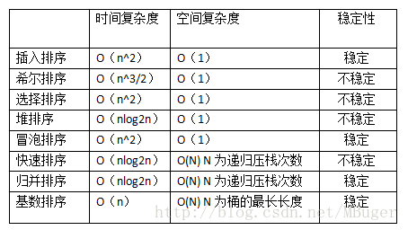

## 1. 乱序算法

```java
public static void shuffle(int[] array) {
    for (int i = array.length-1; i > 0; i--) {
        Random random = new Random();
        int x = random.nextInt(i);
        swap(array, x, i);
    }
}

public static void swap(int[] array, int a, int b) {
    int temp = array[a];
    array[a] = array[b];
    array[b] = temp;
}
```


## 2. 加密算法

常用的对称加密算法有：DES、3DES、RC2、RC4、AES

常用的非对称加密算法有：RSA、DSA、ECC

使用单向散列函数的加密算法：MD5、SHA


##3. 排序算法 

**简介**

- **插入排序**：通过构建有序序列，对于未排序数据，在已排序序列中从后向前扫描，找到相应位置并插入。
- **希尔排序**：对直接插入排序的一种优化，实质就是把直接插入排序改为了分组插入排序。其基本思想就是将整个待排序元素序列按gap（步长）分割为N个组，对每个组进行直接插入排序，然后在减小gap（步长）再进行直接插入排序，直到gap达到最小时，即数组基本达到有序时，再对数组进行直接插入排序，此时直接插入排序就可以达到最高效率。 
- **选择排序**：每次通过从无序的数组中选择出一个最小的（要求升序排列）数把他放到数组的最前面。再依次找次小的数字放到数组无序区的最前。直到数组为有序。 
- **堆排序**：从基本实现原理来说也是一种选择排序，它同样是确定了位置选择符合位置的元素，但是堆排序是更加优化的选择排序的版本，它利用了堆的特性。父结点的值大于子结点，且满足完全二叉树，大大提高了选择排序的效率。
- **冒泡排序**： 相近的两个数字作比较，小的放到前面，大的放后面，按照这个规则从头向后比较，最大的数就被换到了数组尾。 
- **快速排序**：是一种在实际应用中经常用到的排序算法，它的应用场景是大规模的数据排序，并且实际性能要好于归并排序。从数组中选取一个元素，把所有大于这个元素的数都放到它的后面，所有小于这个元素的数都放到它的前面，然后这个元素就把原数组切分成了两个部分，再分别对这个两个部分进行同样的操作，直到数组不能再切分的时候，此时数组为有序。 
- **归并排序**：将两个或两个以上的有序表组合成一个新的有序表，归并排序和快排一样也采用的是分治的思想，它的基本原理是通过对若干个有序结点序列的合并为一个有序序列来实现排序的。 
- **基数排序**：通过分配的方法把元素从小到大分配，以到达排序的作用。 

---

**比较**



---

**应用场景**

(1) 若n较小(如n≤50)，可采用直接插入或直接选择排序。

当记录规模较小时，直接插入排序较好；否则因为直接选择移动的记录数少于直接插人，应选直接选择排序为宜。 

(2) 若文件初始状态基本有序(指正序)，则应选用直接插人、冒泡或随机的快速排序为宜；

(3) 若n较大，则应采用时间复杂度为O(nlgn)的排序方法：快速排序、堆排序或归并排序。

快速排序是目前基于比较的内部排序中被认为是最好的方法，当待排序的关键字是随机分布时，快速排序的平均时间最短；

堆排序所需的辅助空间少于快速排序，并且不会出现快速排序可能出现的最坏情况。

这两种排序都是不稳定的。

若要求排序稳定，则可选用归并排序。但前面介绍的从单个记录起进行两两归并的排序算法并不值得提倡，通常可以将它和直接插入排序结合在一起使用。先利用直接插入排序求得较长的有序子序列，然后再两两归并之。因为直接插入排序是稳定 的，所以改进后的归并排序仍是稳定的。 


## 4. 动态规划和分治法

分治法，动态规划法，这两者之间有类似之处，比如都需要将问题划分为一个个子问题，然后通过解决这些子问题来解决最终问题。但其实这两者之间的区别还是蛮大的。

**1.分治法**

​    分治法（divide-and-conquer）：将原问题划分成n个规模较小而结构与原问题相似的子问题；递归地解决这些子问题，然后再合并其结果，就得到原问题的解。

   分治模式在每一层递归上都有三个步骤：

- 分解（Divide）：将原问题分解成一系列子问题；
- 解决（conquer）：递归地解各个子问题。若子问题足够小，则直接求解；
- 合并（Combine）：将子问题的结果合并成原问题的解。

   合并排序（merge sort）是一个典型分治法的例子。其对应的直观的操作如下：

- 分解：将n个元素分成各含n/2个元素的子序列；
- 解决：用合并排序法对两个子序列递归地排序；
- 合并：合并两个已排序的子序列以得到排序结果。

**2. 动态规划法**

   动态规划[算法](http://lib.csdn.net/base/datastructure)的设计可以分为如下4个步骤：

- 描述最优解的结构
- 递归定义最优解的值
- 按自底向上的方式计算最优解的值
- 由计算出的结果构造一个最优解

​     **分治法是指将问题划分成一些独立地子问题，递归地求解各子问题，然后合并子问题的解而得到原问题的解。与此不同，动态规划适用于子问题独立且重叠的情况，也就是各子问题包含公共的子子问题。**在这种情况下，若用分治法则会做许多不必要的工作，即重复地求解公共的子问题。动态规划算法对每个子子问题只求解一次，将其结果保存在一张表中，从而避免每次遇到各个子问题时重新计算答案。

   **适合采用动态规划方法的最优化问题中的两个要素：最优子结构和重叠子问题。** 

   最优子结构：如果问题的一个最优解中包含了子问题的最优解，则该问题具有最优子结构。

​       重叠子问题：适用于动态规划求解的最优化问题必须具有的第二个要素是子问题的空间要很小，也就是用来求解原问题的递归算法课反复地解同样的子问题，而不是总在产生新的子问题。对两个子问题来说，如果它们确实是相同的子问题，只是作为不同问题的子问题出现的话，则它们是重叠的。

​    **“分治法：各子问题独立   动态规划：各子问题重叠”**

​     算法导论： **动态规划要求其子问题既要独立又要重叠，这看上去似乎有些奇怪。虽然这两点要求听起来可能矛盾的，但它们描述了两种不同的概念，而不是同一个问题的两个方面。如果同一个问题的两个子问题不共享资源，则它们就是独立的。对两个子问题俩说，如果它们确实是相同的子问题，只是作为不同问题的子问题出现的话，是重叠的，则它们是重叠的。**