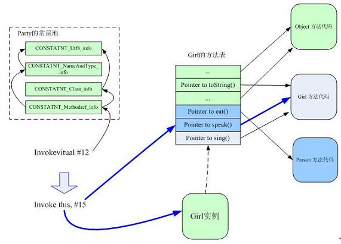

# 多态

## 概念

允许不同子类型的对象对同一消息做出不同响应，也就是用同样的对象引用调用同样的方法但做了不同的事。

- 编译时多态：方法重载（overload，用于一个类内实现若干重载的方法，这些方法名称相同而参数形式不同）
- 运行时多态：方法重写（覆盖，override，用于子类继承父类时，重新实现父类中的方法）

## 原理

Java的方法调用动态绑定的实现主要依赖于**方法表**（这里的方法表 指的是虚方法表）。表中每一项都是指向相应方法的指针。其构造如下：**方法表中最先存放Object类的方法，接着父类的方法，最后该类本身的方法**。

**继承**：

若子类覆盖了父类方法，则子类和父类的同名方法共享一个方法表项，被认为是父类的方法。由于方法的排列特性（Object--父类--子类），使得方法表的偏移量总是固定。（这里相当于是种优化，避免遍历）

在调用方法时：

（1）首先查找常量池，找到方法的Class，再得到方法表中的该方法的偏移量

（2）调用对象引用偏移位置的方法

**接口**：不能采用固定偏移量，需要遍历类的方法表查找

通过继承和接口的多态实现有所不同。

继承：在执行某个方法时，在方法区中找到该类的方法表，再确认该方法在方法表中的偏移量，找到该方法后如果被重写则直接调用，否则认为没有重写父类该方法，这时会按照继承关系搜索父类的方法表中该偏移量对应的方法。 

接口：Java 允许一个类实现多个接口，从某种意义上来说相当于多继承，这样同一个接口的的方法在不同类方法表中的位置就可能不一样了。所以不能通过偏移量的方法，而是通过搜索完整的方法表。

 JVM 首先查看 **Party 的常量池**索引为 12 的条目（应为 CONSTANT_Methodref_info 类型，可视为方法调用的符号引用），进一步查看常量池（CONSTANT_Class_info，CONSTANT_NameAndType_info ，CONSTANT_Utf8_info）可**得出要调用的方法是 Person 的 speak 方法**（注意引用 girl 是其基类 Person 类型），**查看 Person 的方法表**，得出 speak 方法在该方法表中的偏移量 15（offset），这就是该方法调用的**直接引用**。