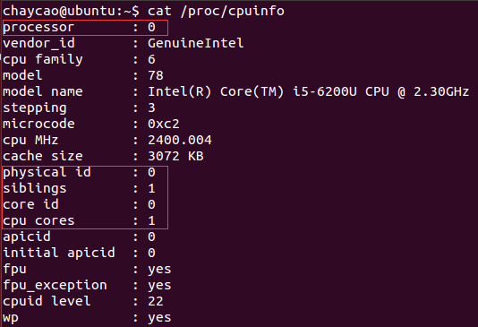
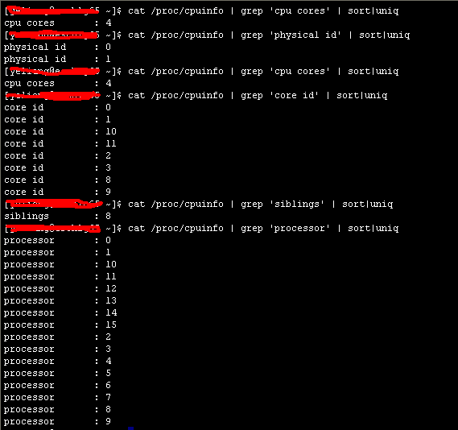
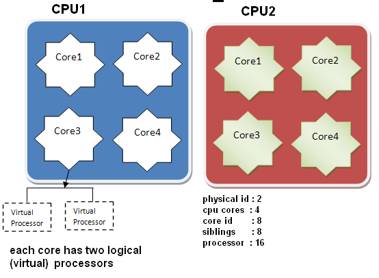
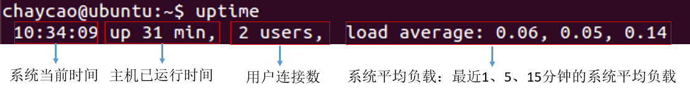
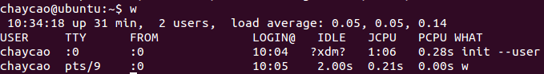
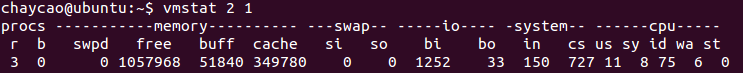

# 常用命令

## 查看CPU信息

CPU的信息在启动过程中被装载到虚拟目录/proc下的cpuinfo中

```bash
cat /proc/cpuinfo
```



重要指标：

- process：逻辑处理器的ID
- physical id：物理封装的处理器ID
- siblings：位于相同物理封装的处理器中的逻辑处理器的忽略
- cpu id：内核的ID
- cpu cores：位于相同物理封装的处理器中的内核数量



在该服务器上

- physical id 有2个 —— 有两个物理CPU
- cpu cores 为4 —— 1个物理CPU里有4个内核
- core id 有8个 —— 总共有8个内核 (所有物理CPU内核总数）
- silbings 为8 —— 1个物理CPU里有8个逻辑CPU
- processor 有16个——总共有16个逻辑CPU

总核数 = 物理CPU个数 * 每颗物理CPU的核数

总逻辑CPU数 = 物理CPU个数 * 每颗物理CPU的核数 * 超线程数




```bash
# 查看物理CPU个数 
cat /proc/cpuinfo| grep 'physical id'| sort| uniq| wc -l

# 查看每个物理CPU的核数
cat /proc/cpuinfo| grep 'cpu cores'| uniq

# 查看逻辑CPU的个数
cat /proc/cpuinfo| grep 'processor'| wc -l
```

---

## 查看系统负载

Linux 的负载高，主要是由于下面三部分构成：

- CPU使用
- 内存使用
- IO消耗

**1.uptime**



系统平均负载：特定时间间隔内运行队列中的平均进程数

若每个CPU内核的当前活动进程数不大于3，性能良好

若大于5，则系统超负荷运转

**2.w**



**3.top**

Linux下的任务管理器，能够实时显示系统中各个进程的资源占用状况，[查看命令详细]((命令详解/top.md))


**4.free**

相比top，提供更简洁的系统内存使用情况，[查看命令详细](命令详解/free.md)


**5.vmstat**

展现给定时间间隔的服务器状态值，如CPU使用率、内存使用、虚拟内存交换情况、IO读写情况，[查看命令详细](命令详解/vmstat.md)



---

## 查看网卡流量

1. sar


