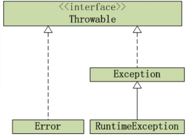
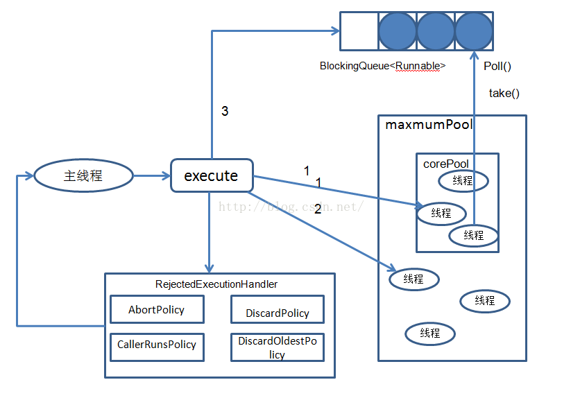

## 1. HashMap什么情况下发生死链 

JDK1.8之前，并发resize()的时候可能会发生死链。

[参考](https://coolshell.cn/articles/9606.html)

## 2. HashMap

**HashMap的特性？**

HashMap 存储键值对，实现快速存取数据；允许null键\值；非同步；不保证有序

**HashMap的原理，内部数据结构？**

基于hashing的原理，jdk1.8之前底层使用哈希表（数组+链表）实现。jdk1.8之后，当链表长度大于8时，将链表转换成红黑树。

HashMap中的最重要两个方法put、get

put方法的原理：传入k，v，通过取hashcode，高位参与运算、取模运算三步，获得bucket位置，进行存储，如果没有碰撞直接放bucket里，如果碰撞，以链表形式存在buctets后，如果节点已经存在就替换oldvalue。当hashmap的bucket占用情况超过capacity*load_factor则，通过resize方法扩容为2倍。

get方法的原理：传入k，通过取hashcode，高位参与运算、取模运算三步，获得bucket位置，并进一步调用equals方法确定键值对。

**当两个对象的hashcode相同会发生什么？**

若两个对象的hashcode相同，则他们的bucket位置相同，会发生碰撞。

**有哪些hash的实现方式？**

- 直接定址法：取k的某个线性函数值为散列地址。
- 数字分析法：提取关键字k中取值比较均匀的数字作为哈希地址。例如，生日使用月份和日期构成散列地址。
- 除留余数法：用关键字k除以某个不大于哈希表长度m的数p，将所得余数作为哈希表地址。
- 分段叠加法：按照哈希表地址位数将关键字分成位数相等的几部分，其中最后一部分可以比较短。然后将这几部分相加，舍弃最高进位后的结果就是该关键字的哈希地址。
- 平方取中法：如果关键字各个部分分布都不均匀的话，可以先求出它的平方值，然后按照需求取中间的几位作为哈希地址。
- 伪随机数法：采用一个伪随机数当作哈希函数。

**有哪些hash冲突解决办法？**

- 开放地址法：一旦发生了冲突，就去寻找下一个空的散列地址，只要散列表足够大，空的散列地址总能找到，并将记录存入。
- 链地址法：将哈希表的每个单元作为链表的头结点，所有哈希地址为i的元素构成一个链表。即发生冲突时就把该关键字链在以该单元为头结点的链表的尾部。
- 再哈希法：当哈希地址发生冲突用其他的函数计算另一个哈希函数地址，直到冲突不再产生为止。
- 建立公共溢出表：将哈希表分为基本表和溢出表两部分，发生冲突的元素都放入溢出表中。

**为什么String、Integer适合作为键？**

- 已重写了equals()和hashCode()。（让不相等的对象返回不同的hashcode值）
- 具有不可变性，可防止键值的改变，线程安全 

**HashMap与HashTable区别？**

1. 线程安全性。HashTable中几乎所有函数是同步的，所以它是线程安全的。HashMap是线程不安全的。
2. NULL值。HashMap的key、value都可为null，Hashtable都不可为null
3. 容器的初始值和扩容方式。HashMap默认16，扩容 （原始容量*2）,；HashTable默认11，扩容 （原始容量 * 2+1）
4. HashMap继承于AbstractMap，HashTable继承于Dictionary
5. hash算法。HashMap自定义的哈希算法；HashTable直接采用key的hashCode()；
6. 速度。单线程环境下HashMap更快

**让HashMap同步**

Collections.synchronizeMap()


## 3. 多线程顺序执行 

（1） 有A、B、C、D四个线程，A线程输出A, B线程输出B, C线程输出C，D线程输出D，要求, 同时启动四个线程, 按顺序输出ABCD 

答：通过Thread.join()方法，B、C、D分别持有A、B、C的引用，并且在输出前调用持有线程的join方法，等待线程执行完毕，再输出。

```java
package thread;

public class TestThread1 {

    public static void main(String[] args) {

        // 线程A
        final Thread a = new Thread(new Runnable() {
            @Override
            public void run() {
                System.out.println("A");
            }
        });

        // 线程B
        final Thread b = new Thread(new Runnable() {
            @Override
            public void run() {
                try {
                    // 执行b线程之前，加入a线程,让a线程执行
                    a.join();
                } catch (InterruptedException e) {
                    e.printStackTrace();
                }
                System.out.println("B");
            }
        });

        // 线程C
        final Thread c = new Thread(new Runnable() {
            @Override
            public void run() {
                try {
                    // 执行c线程之前，加入b线程,让b线程执行
                    b.join();
                } catch (InterruptedException e) {
                    e.printStackTrace();
                }
                System.out.println("C");
            }
        });

        // 线程D
        Thread d = new Thread(new Runnable() {
            @Override
            public void run() {
                try {
                    // 执行d线程之前，加入c线程,让c线程执行
                    c.join();
                } catch (InterruptedException e) {
                    e.printStackTrace();
                }
                System.out.println("D");
            }
        });

        // 启动四个线程
        a.start();
        b.start();
        c.start();
        d.start();

    }

}
```

（2） 有A,B,C三个线程, A线程输出A, B线程输出B, C线程输出C。要求, 同时启动三个线程, 按顺序输出ABC, 循环10次 

使用ReentrantLock控制并发,并使用一个state整数来判断应哪个线程执行。 

```java
public class Test {
    private static ReentrantLock lock = new ReentrantLock();
    private static int state = 0;
    
    static class A extend Thread() {
        @Override
        public void run() {
            lock.lock();
            for (int i = 0; i < 10;) {
                if (state%3 == 0) {
                    System.out.println("A");
                }
                i++;
                state++;
            }
            lock.unlock();    
        }        
    }
    
    static class B extend Thread() {
        @Override
        public void run() {
            lock.lock();
            for (int i = 0; i < 10;) {
                if (state%3 == 1) {
                    System.out.println("B");
                }
                i++;
                state++;
            }
            lock.unlock();    
        }        
    }    
    
    static class C extend Thread() {
        @Override
        public void run() {
            lock.lock();
            for (int i = 0; i < 10;) {
                if (state%3 == 2) {
                    System.out.println("C");
                }
                i++;
                state++;
            }
            lock.unlock();    
        }        
    }
    
    public static void main(String[] args) {
        new A().start();
        new B().start();
        new C().start();
    }
}

```


## 4. hashCode()与equals()

equals()方法用来判断两个对象是否相等，Object默认比较对象地址

hashCode()方法用来获取哈希码，Object默认根据对象地址转换成一个整数

**为什么重写equals()一定要重写hashCode()方法**

这是因为HashMap等哈希表是由hashcode()定位要存放的位置，而equals()判断是否相等，这意味着逻辑上equals()相等，认为这两个对象相等则应该放在同一个桶中，所以hashcode()也需要相等。 

**hashCode的作用**

用于查找，在HashMap、HashTable等散列表中用hashCode确定对象的存储地址。


## 5. Java内存模型

Java内存模型（JMM）是一种虚拟机规范，定义了多线程之间共享变量的可见性。采用的是共享内存模型，**线程之间的共享变量存储在主内存中，每个线程都有一个私有的本地内存，本地内存中存储了该线程读\写共享变量的副本**。


## 6. Object的公用方法

- toString()
- equals()
- hashCode()
- wait()、notify()、notifyAll()
- clone()
- getClass()
- finalize()


## 7. String、StringBuffer、StringBuilder

- **String**：不可变对象，每次改变相当于生成新的String对象
- **StringBuffer**：可变对象，线程安全
- **StringBuilder**：可变对象，线程不安全，速度比StringBuffer快


## 8. 创建对象的方式

1. 用 new 语句创建对象
2. 反射，调用 java.lang.Class 或 java.lang.reflect.Constructor 类的 newInstance() 实例方法
3. 调用对象的 clone() 方法
4. 反序列化，通过 java.io.ObjectInputStream 对象的 readObject() 方法

1、2会调用构造函数

3 是在内存上对已有对象的影印，不会调用构造函数

4 是从文件中还原，不会调用构造函数


## 9. try里有return，finally是否执行

会执行，在return表达式之后执行，返回之前执行

finally里的修改语句可能影响也可能不影响try或catch中 return已经确定的返回值，若finally里也有return语句则覆盖try或catch中的return语句直接返回。 

[参考](http://www.cnblogs.com/lanxuezaipiao/p/3440471.html)


## 10. Exception与Error



**联系：**

- Error和Exception都继承于 Throwable 接口，RuntimeException 继承自 Exception
- Error和RuntimeException及其子类称为未检查异常（Unchecked exception），其他异常为受检查异常

**区别：**

- Error类，
  - 指与虚拟机相关的问题，如系统崩溃、虚拟机错误、内存空间不足、栈溢出等，java.lang.StackOverFlowError、java.lang.OutOfMemoryError
  - 编译器不检查
  - 导致的应用程序中断，仅靠程序本身无法恢复和预防，建议让程序终止
- Exception类
  - 程序可以处理的异常，可以捕获且可能恢复
  - 遇到这类异常，应该尽可能处理


运行时异常和受检查异常

- 运行时异常：Java编译器不检查，如果出现运行时异常，一定是程序问题，如除数为0、错误的类型转换、数组越界访问、试图访问空指针
- 受检查异常：如果没有try..catch或throws，编译不通过，不是程序本身错误，而是应用环境中出现的外部问题


## 11. Java面向对象的三个特征和含义

**封装**：**把数据和方法绑定起来，对数据的访问只能通过已定义的接口**，也就是隐藏一切可隐藏的东西，只向外界提供最简单的编程接口Java的四种访问控制符：public，default，protected，private 

**继承**：**从已有类得到继承信息创建新类的过程**。提供继承信息的类称为父类；得到继承信息的类称为子类继承使变化中的软件系统具有一定的延续性，同时继承使封装程序中具有扩展性Java中的extends（用于基本类和抽象类）和implements（用于接口），extends单继承，implements不限 

**多态**：**允许不同子类型的对象对同一消息做出不同响应**，也就是用同样的对象引用调用同样的方法但做了不同的事。分为

- 编译时多态：方法重载（overload，用于一个类内实现若干重载的方法，这些方法名称相同而参数形式不同）
- 运行时多态：方法重写（覆盖，override，用于子类继承父类时，重新实现父类中的方法） 


## 12. Interface 与 Abstart 的区别

两者的特性：

- 抽象类：用来捕捉子类的通用特性。不能被实例化，只能作为子类的超类，被用来创建继承层级里子类的模板
- 接口：抽象方法的集合，像契约模式，若实现该接口，则必须确保使用接口中的方法对比： 

| 参数         |                          抽象类                           | 接口                                       |
| ------------ | :-------------------------------------------------------: | ------------------------------------------ |
| 默认方法实现 |                           可以                            | 不可以                                     |
| 实现         | extends关键字。若子类不是抽象类，需提供所有声明方法的实现 | implements关键字。需提供所有声明方法的实现 |
| 构造器       |                          可以有                           | 可以有                                     |
| 访问修饰符   |            public、protected、default、private            | 默认public不可以其他                       |
| main方法     |                          可以有                           | 不可以                                     |


## 13. 静态内部类 与 非静态内部类 区别

- 静态内部类：不需要有指向外部类对象的引用；可以访问静态成员
- 非静态内部类：需要有指向外部类对象的引用；可以访问静态成员和非静态成员； 


## 14. 多态的实现原理

[参考](../JavaSE/语法/多态.md)


## 15. ThreadLocal的设计理念和作用

[参考](../JavaSE/并发/ThreadLocal.md)


## 16. foreach

效率 还是得看普通for里的具体操作

对于ArrayList，普通for快一点，减少了“解除语法糖”的操作

对于LinkedList，linkedlist.get(）每次都从头开始了，foreach就快很多，

foreach能使用的类型：数组、java.lang.Iterable

- 数组：转化为对数组中每个元素的循环引用
- Iterable接口，调用next()、hasNext()方法做循环遍历


## 17. 反射的实现原理

[参考](../JavaSE/语法/反射.md)


## 18. synchronized

synchronized 是Java中的关键字，可以控制多线程对共享资源的访问。在Java中每一个对象都可以作为锁

当synchronized作用于以下三种情况：

- 对于普通同步方法，锁是当前实例对象
- 对于静态同步方法，锁是当前类的Class对象
- 对于同步方法块，锁是Synchronized括号里配置的对象

**实现原理**：

JVM 基于进入和退出 Monitor 对象来实现方法同步、代码块同步

代码块同步：使用 monitorenter、monitorexit 指令实现

方法同步：方法调用指令读取运行时常量池中方法的 ACC_SYNCHRONIZED 标志辨别是否为同步方法

**synchronized和lock的区别**

- 用法

  - synchronized加在方法、特定代码块上，括号中表示需要锁的对象
  - lock需要通过lock()和unlock()显示指定起始位置和终止位置

- 性能

  - synchronized由JVM实现，lock是由Java代码实现
  - 在1.6之前，lock性能更高
  - 1.6之后，synchronized加了锁优化，（适应自旋，锁消除，锁粗化，轻量级锁，偏向锁），性能不比lock差

- 用途

  - lock更加灵活
    - 某个线程在等待一个锁的控制权的这段时间需要中断 
    - 需要分开处理一些wait-notify，ReentrantLock里面的Condition应用，能够控制notify哪个线程 
    - 具有公平锁功能，每个到来的线程都将排队等候 

  

## 19. Socket 编程

服务端：

1. 构建一个 ServerSocket 实例，指定本地端口，该 socket监听指定端口的连接请求
2. 重复以下步骤：
   1. 调用 accept() 方法获得客户端的连接请求，通过 accept() 方法返回的 socket 实例，建立一个和客户端的新连接
   2. 通过返回的 socket 实例获取 InputStream 和 OutputStream 来读写数据
   3. 通过 close() 方法关闭 socket 连接

客户端：

1. 构建 Socket 实例，通过制定的远程服务器和端口建立连接
2. 通过 Socket 实例包含的 InputStream 和 OutputStream 来进行数据的读写
3. 操作结束调用 socket 实例的 close 方法。


## 20. Java 读文件的几种方式

1. 按字节读取
2. 按字符读取
3. 按行读取
4. 随机读取

[参考](http://www.cnblogs.com/lovebread/archive/2009/11/23/1609122.html)


## 21. 防止表单重复提交

**1、场景一：在网络延迟的情况下让用户有时间点击多次submit按钮导致表单重复提交。**

在网络比较慢的情况下，用户连续快速的点击多次提交按钮。

**2、场景二：表单提交后用户点击【刷新】按钮导致表单重复提交。** 

用户点击了提交按钮，然后点击浏览器上的【刷新】按钮对form表单又进行一次提交。

**3、场景三：用户提交表单后，点击浏览器的【后退】按钮回退到表单页面后进行再次提交**


**解决方案一：利用JavaScript防止表单重复提交。**
在客户端的js代码中设置一个标识位，第一次提交后将标志位设置成true，或将提交按钮设置为不可用

**解决方案二：利用Session防止表单重复提交**
对于【场景二】和【场景三】导致表单重复提交的问题，既然客户端无法解决，那么就在服务器端解决，在服务器端解决就需要用到session了。

**具体的做法：**

在服务器端生成一个唯一的随机标识号，专业术语称为Token(令牌)，同时在当前用户的Session域中保存这个Token。然后将Token发送到客户端的Form表单中，在Form表单中使用隐藏域来存储这个Token，表单提交的时候连同这个Token一起提交到服务器端，然后在服务器端判断客户端提交上来的Token与服务器端生成的Token是否一致，如果不一致，那就是重复提交了，此时服务器端就可以不处理重复提交的表单。如果相同则处理表单提交，处理完后清除当前用户的Session域中存储的标识号。

 在下列情况下，服务器程序将拒绝处理用户提交的表单请求：

1. 存储Session域中的Token(令牌)与表单提交的Token(令牌)不同。
2. 当前用户的Session中不存在Token(令牌)。
3. 用户提交的表单数据中没有Token(令牌)。

[参考](http://www.cnblogs.com/xdp-gacl/p/3859416.html)


## 22. BIO、NIO、AIO

- BIO：同步阻塞
- NIO：同步非阻塞
- AIO：异步非阻塞

 

 ## 23. 获取方法参数名

在Java 8之前的版本，代码编译为class文件后，方法参数的类型是固定的，但参数名称却丢失了 ，为无意义的`arg0`、`arg1` 。

为了获得参数名，可通过以下两种方法获得：

1. **通过注解** 

   ```java
   public User getUser(@Param("groupid") String groupid, @Param("userid") String userid) {
       ...
   }
   ```

2. **从class文件中获取**

   javac默认不会生成本地变量表信息，需指定```-g```或```-g:vars```，从class文件中获取参数名信息，可使用第三方类库 asm、javassist等操作。

---

**Java 8新特性，编译器保留方法参数名**，使用```-parameters```参数编译


## 24. 线程池

**概念**：一种多线程处理方式，线程池维护多个线程，等待被分配任务

**作用**：限制系统中执行线程的数量

**为什么使用线程池**：

1. 减少创建和销毁线程的数量，工作线程可被重复利用
2. 可根据系统的承受能力，调整线程池中工作线程的数量

**四个基本组成**：

1. 线程池管理器（ThreadPool）：用于创建并管理线程池
2. 工作线程（PoolWorker）：线程池中线程可循环执行任务
3. 任务接口（Task）：每个任务需实现的接口，以供工作线程调度任务的执行（任务入口，收尾工作，执行状态）
4. 任务队列（TaskQueue）：存放未处理任务

---

**Java线程池的实现类：ThreadPoolExecutor**

```java
public ThreadPoolExecutor(int corePoolSize,
                          int maximumPoolSize,
                          long keepAliveTime,
                          TimeUnit unit,
                          BlockingQueue<Runnable> workQueue,
                          ThreadFactory threadFactory,
                          RejectedExecutionHandler handler) 
```

**线程池参数**

1. **corePoolSize**：线程池的基本大小，当提交任务到线程池时，即使有其他空闲的基本线程也会创建线程。当基本线程数量达到corePoolSize则不再创建
2. **maximumPoolSize**：线程池允许创建的最大线程数。如果阻塞队列满了，并且已经创建的线程数小于最大线程数，则线程池会再创建新的线程执行任务。 
3. **keepAliveTime**：线程活动保持时间。指工作线程空闲后，继续保持存活的时间。默认情况下，这个参数只有在线程数大于corePoolSize时才起作用（也可设置对核心线程起作用）。所以，如果任务很多，且每个任务的执行时间比较短，可以调大keepAliveTime，提高线程的利用率。 
4. **unit**：保持时间的单位
5. **workQueue**：用来保存等待执行的任务的阻塞队列 
   - ArrayBlockingQueue：基于数组结构的有界阻塞队列，按FIFO原则对元素进行排序。
   - LinkedBlockingQuene：基于链表结构的阻塞队列，按FIFO排序元素，吞吐量通常要高于ArrayBlockingQuene。
   - SynchronousQuene：一个不存储元素的阻塞队列，每个插入操作必须等到另一个线程调用移除操作，否则插入操作一直处于阻塞状态，吞吐量通常要高于LinkedBlockingQuene。
   - priorityBlockingQuene：具有优先级的无界阻塞队列。
6. **threadFactory**：创建线程的工厂。可以通过自定义线程工厂给每个线程设置有意义的名称 
7. **rejectedExecutionHandler**：饱和策略。当阻塞队列满了且没有空闲的工作线程，说明线程池处于饱和状态，那么必须采取一种策略处理提交的新任务。这个策略在默认情况下是AbortPolicy，表示无法处理新任务时抛出异常。不过，线程池提供了4种策略：
   - AbortPolicy：直接抛出异常。
   - CallerRunsPolicy：只用调用者所在的线程来运行任务。
   - DiscardOldestPolicy：丢弃阻塞队列中最近的一个任务，并执行当前任务。
   - DiscardPolicy：直接丢弃。

---

**Executors**

Exectors是java线程池的工厂类，通过它可以快速初始化一个符合业务需求的线程池，主要提供了以下几种便捷的方式：

**1.newFixedThreadPool**：创建一个指定工作线程数的线程池，其中参数corePoolSize和maximumPoolSize相等，阻塞队列基于LinkedBlockingQuene。

```java
public static ExecutorService newFixedThreadPool(int nThreads) {
return new ThreadPoolExecutor(nThreads, nThreads,
                              0L, TimeUnit.MILLISECONDS,
                              new LinkedBlockingQueue<Runnable>());
}
```

优点：提高程序效率和节省创建线程时所耗的开销

缺点：在线程池空闲时，即线程池中没有可运行任务时，它不会释放工作线程，还会占用一定的系统资源。 

**2.newCachedThreadPool**：创建一个可缓存工作线程的线程池（工作线程默认存活时间1分钟）。

```java
public static ExecutorService newCachedThreadPool() {
 return new ThreadPoolExecutor(0, Integer.MAX_VALUE,
                               60L, TimeUnit.SECONDS,
                               new SynchronousQueue<Runnable>());
}
```

该线程池有以下特点：
1、工作线程数量几乎没有上限，因为maximumPoolSize为Integer.MAX_VALUE（2147483647）。
2、如果长时间没有提交任务，且工作线程空闲了指定的时间，则该工作线程将自动终止。如果重新提交了任务，则线程池重新创建一个工作线程。

优点：在没有任务执行时，会释放工作线程，从而释放工作线程所占用的资源。

缺点：当提交新任务时，没有空闲线程时，又要创建新的工作线程，有一定的系统开销。另外一定要注意控制任务的数量，否则由于大量线程同时运行，很有会造成系统瘫痪。

**3.newSingleThreadExecutor**：创建一个只有单一工作线程的线程池。如果这个工作线程异常结束，会有另一个取代它。唯一的工作线程可以保证任务的顺序执行。

```java
new ThreadPoolExecutor(1, 1, 
                       0L, TimeUnit.MILLISECONDS, 
                       new LinkedBlockingQueue<Runnable>())
```

**4.newScheduledThreadPool**：创建一个可以在指定时间内周期性的执行任务的线程池。在实际业务中常用的场景是周期性的同步数据。

---

**任务提交**

向线程池提交任务有两种：

**1.execute()**：用于提交不需要返回值的任务，这个方式无法判断任务是否执行成功。

```java
executor.execute(runnableTask);
```

**2.submit()**：用于提交需要返回值的任务。线程池会返回一个Future对象，通过这个对象可以判断任务是否执行成功。

```java
Future future = executor.submit(callableTask);
```

---

**实现原理**

线程池的运行状态：

1. RUNNING ： 接受新任务并且处理已经进入阻塞队列的任务。
2. SHUTDOWN ： 不接受新任务，但是处理已经进入阻塞队列的任务。
3. STOP : 不接受新任务，不处理已经进入阻塞队列的任务并且中断正在运行的任务。
4. TIDYING : 所有的任务都已经终止，workerCount为0， 线程转化为TIDYING状态并且调用terminated钩子函数 。
5. TERMINATED: terminated钩子函数已经运行完成。

当向线程池提交一个任务时，如图所示：




1. 如果当前运行的线程数少于corePoolSize，则创建新的工作线程处理任务，否则进入步骤2。
2. 如果线程池处于运行状态，则把任务放入BlockingQueue中，如果可用工作线程为0时，则创建新的工作线程，处理BlockingQueue的任务。
3. 如果无法将任务加入到BlockingQueue，则创建新的线程处理任务，前提是目前运行的线程数小于maximumPoolSize，否则进入步骤4 任务被拒绝。


**线程池的数量设置**：

最佳线程数数目 = (线程等待时间与线程CPU时间之比 + 1 ) * CPU数目

- 如果是CPU密集型应用，则线程池大小设置为N+1（当计算密集型的线程偶尔由于缺失故障或者其他原因而暂停时，这个额外的线程也能确保CPU的时钟周期不会被浪费）
- 如果是IO密集型应用，则线程池大小设置为2N+1


## 25. 抽象类与接口

相同点：

- **不能实例化**
- 抽象类中可以包含**非抽象的普通方法**，接口中可以有非抽象的非抽象方法，比如default方法
- 都可以有**静态成员变量**

不同点：

- 抽象类可以有**构造方法**，接口中不能
- 抽象类可以有**普通成员变量**，接口中不能
- 抽象类的**抽象方法的访问类型**可以是public 、protected，但接口中的抽象方法只能是public
- 抽象类中可以包含**静态方法**，接口中不能
- 抽象类中**静态成员变量的访问类型**可以任意，接口中的变量只能是public static final类型
- 一个类可以实现多个接口，但只能继承一个抽象类。

---

**抽象类里面的方法子类必须全部实现吗，可不可以有不实现的方法，接口呢？** 

- 抽象类不一定，子类只会实现父类里的抽象方法，抽象类里可以有抽象方法也可以非抽象方法，子类不需要再去实现非抽象方法，如果子类一定要再次实现的话就叫做覆盖了 		
- 接口里的方法必须全部实现，因为接口里的方法都是抽象的，默认都是public abstract

**抽象类的作用是什么，什么时候用到抽象类**

封装（隐藏对象的属性和实现细节，仅对外公开接口）


## 26. Arrays.sort()和Collections.sort()

Java8中Arrays的排序方法只提供了两种算法的实现： 

- sort方法：双轴快速排序算法实现。

- parallelSort方法：并行归并排序算法实现。 

  

1. 在双轴快速排序算法中，如果数组的长度小于47，采用插入排序或成对插入排序算法实现。 
2. 数组长度小于286，会直接使用双轴快排。 
3. 如果数组中局部有序的片段比较多，则采用TimSort排序算法（一种改进的归并排序算法）。 


Collections.sort的方法也最终调用的是Arrays.sort方法的 