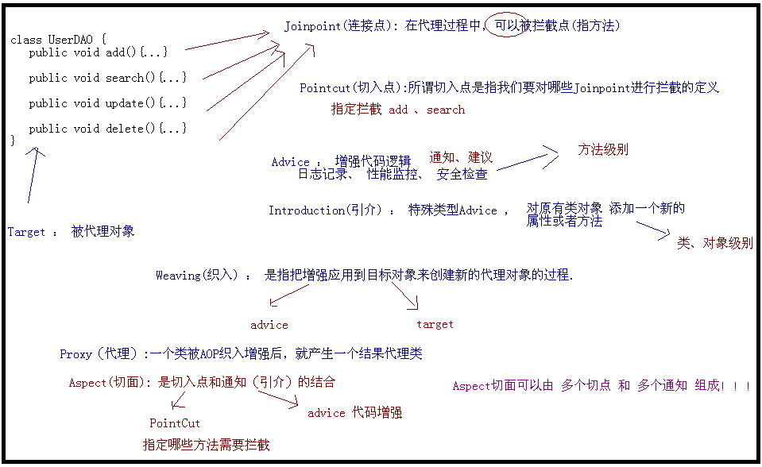

## 1. IOC 和 DI

IOC，控制反转，将原本在程序中手动创建对象的控制权，交由Spring框架管理。

DI，依赖注入，在Spring框架负责创建Bean对象时，动态的将依赖对象注入到Bean组件 。

Spring中依赖注入有三种方式：

1. 构造器注入
2. setter方法注入
3. 注解注入


## 2. BeanFactory 接口和 ApplicationContext 接口

ApplicationContext 是BeanFactory的子接口。

Spring核心工厂是BeanFactory，**BeanFactory采取延迟加载**，第一次getBean时才会初始化Bean。 **ApplicationContext是会在加载配置文件时初始化Bean**。

**ApplicationContext是对BeanFactory扩展，它可以进行国际化处理、事件传递和bean自动装配以及各种不同应用层的Context实现**。

开发中基本都在使用ApplicationContext, web项目使用WebApplicationContext ，很少用到BeanFactory。


## 3. bean实例化的三种方式

XML 配置中实例化 bean 的三种方式：

1. **普通构造方法**

   ```xml
   <bean class="org.sang.User" id="user"/>
   ```

2. **静态工厂**

   ```xml
   <bean id="user2" class="org.sang.User2Factory" factory-method="getInstance"/>
   ```

3. **实例工厂**

   ```xml
   <bean class="org.sang.User3Factory" id="user3Factory"/>
   <bean id="user3" factory-bean="user3Factory" factory-method="getUser3"/>
   ```

   

## 4. bean的生命周期和作用域

对于 prototype 作用域的 Bean，Spring容器仅负责创建，当容器创建 Bean 实例后，Bean 实例由客户端代码管理，容器不再跟踪其生命周期。即 **Spring 无法管理 prototype 作用域的 Bean**。

对于 singleton 作用域的 Bean，客户端代码不能控制 Bean 的销毁，Spring 容器负责跟踪 Bean 实例的产生、销毁。容器知道 Bean 何时实例化结束、何时销毁，**Spring 可以管理 Singleton 作用域的 Bean 实例化结束之后和销毁之前的行为**。

---

**Spring中Bean的生命周期**：

1. 实例化一个Bean（new）

2. 按照Spring上下文对实例化的Bean进行配置，IOC注入

3. 若实现 BeanNameAware 接口，会调用 setBeanName(String) 方法，传入配置文件中的Bean的 id 值

4. 若实现 BeanFactoryAware 接口，会调用 setBeanFactory(BeanFactory) 方法，传入Spring上下文

5. 若实现 ApplicationContextAware 接口，会调用 setApplicationContext(ApplicationContext) 方法，传入Spring上下文

6. 若关联 BeanPostProcessor 接口，将会调用 postProcessBeforeInitialization(Object obj, String s) 方法

7. 若配置了 init-method 属性会自动调用其配置的初始化方法

8. 若关联 BeanPostProcessor 接口，将会调用 postProcessAfterInitialization(Object obj, String s) 方法

   以上工作完成后，可以使用该Bean

9. 当Bean不再使用时，进入清理阶段，若实现了 DisposableBean接口，调用 destroy() 方法

10. 若配置了 destory-method 属性，会自动调用其配置的销毁方法


---

**作用域：**

1. singleton：默认，容器内只会一个 bean 的实例
2. prototype：为每一个请求提供一个实例
3. request：在一次HTTP请求中，一个bean定义对应一个实例；即每次HTTP请求将会有各自的bean实例， 它们依据某个bean定义创建而成。该作用 域仅在基于web的Spring ApplicationContext情形下有效。 
4. session：在一个HTTP Session中，一个bean定义对应一个实例。该作用域仅在基于web的Spring ApplicationContext情形下有效。
5. global session：在一个全局的HTTP Session中，一个bean定义对应一个实例。典型情况下，仅在使用portlet context的时候有效。该作用域仅在基于 web的Spring ApplicationContext情形下有效。 


## 5. AOP 实现原理

AOP，面向切面编程，作为面向对象的一种补充，用于处理系统中分布于各个模块的横切关注点，比如事务管理、日志、缓存等等

**AOP 的关键在于AOP框架自动创建的AOP代理**。

AOP代理分为**静态代理**、**动态代理**。

AspectJ 为 静态代理，Spring AOP 为动态代理。

---

**AspectJ**

静态代理，在编译阶段生成AOP代理，也称编译时增强。

在编译阶段将Aspect织入Java字节码中，运行的时候就是经过增强之后的AOP对象。

---

**Spring AOP**

动态代理，不会修改字节码，而是在内存中临时为方法生成一个AOP对象，该AOP对象包含了目标对象的全部方法，并在特定的切点做了增强处理，并回调原对象的方法。

有两种方式：

- **JDK动态代理**：通过反射来接收被代理的类，并要求被代理的类必须实现一个接口。核心是 InvocationHandler接口 和 Proxy 类。
- **CGLIB（Code Generation Libary）动态代理**：若目标类没有实现接口，则使用CGLIB来动态代理目标类。CGLIB是一个代码生成的类库，可以在运行时动态的生产某个类的子类，由于CGLIB通过继承的方式，所以如果某个类被标记为final，则无法使用CGLIB做动态代理


## 6. 事务管理

**事务**是对一系列的数据库操作进行统一的提交或回滚操作，如果插入成功，那么一起成功，如果中间有一条出现异常，那么回滚之前的所有操作。

**Spring 事务管理的API** ：

- TransactionDefinition：给定的事务规则
- PlatformTransactionManager：按照...来执行提交或回滚操作
- TransactionStatus：表示事务本身，可提交、回滚


Spring中事务支持两种模式：编程式事务、声明式事务

**编程式事务**

通过Spring提供的事务管理API，在代码中灵活控制事务的执行。在底层，Spring 仍然将事务操作委托给底层的持久化框架来执行。 

1. 基于底层API的编程式事务

```java
public class BankServiceImpl implements BankService {
    private BankDao bankDao;
    private TransactionDefinition txDefinition;
    private PlatformTransactionManager txManager;
    ......

    public boolean transfer(Long fromId， Long toId， double amount) {
        // 获取一个事务
        TransactionStatus txStatus = txManager.getTransaction(txDefinition);
        boolean result = false;
        try {
            result = bankDao.transfer(fromId， toId， amount);
            txManager.commit(txStatus);    // 事务提交
        } catch (Exception e) {
            result = false;
            txManager.rollback(txStatus);      // 事务回滚
            System.out.println("Transfer Error!");
        }
        return result;
    }
}
```

相应的配置文件

```xml
<bean id="bankService" class="footmark.spring.core.tx.programmatic.origin.BankServiceImpl">
    <property name="bankDao" ref="bankDao"/>
    <property name="txManager" ref="transactionManager"/>
    <property name="txDefinition">
    <bean class="org.springframework.transaction.support.DefaultTransactionDefinition">
    	<property name="propagationBehaviorName" value="PROPAGATION_REQUIRED"/>
    </bean>
    </property>
</bean>
```

2. 基于 TransactionTemplate 的编程式事务管理 

```java
public class BankServiceImpl implements BankService {
    private BankDao bankDao;
    private TransactionTemplate transactionTemplate;
    ......
    public boolean transfer(final Long fromId， final Long toId， final double amount) {
    	return (Boolean) transactionTemplate.execute(new TransactionCallback(){
    		public Object doInTransaction(TransactionStatus status) {
    			Object result;
            try {
            	result = bankDao.transfer(fromId， toId， amount);
            } catch (Exception e) {
            status.setRollbackOnly();
            result = false;
            System.out.println("Transfer Error!");
	    	}
    		return result;
    	}
    });
    }
}
}}
```


**声明式事务**

Spring 的声明式事务管理是**建立在 Spring AOP 机制之上**的，其本质是**对目标方法前后进行拦截，并在目标方法开始之前创建或者加入一个事务，在执行完目标方法之后根据执行情况提交或者回滚事务**。 

声明式事务得益于 Spring IoC容器 和 Spring AOP 机制的支持：IoC容器为声明式事务管理提供了基础设施，使得 Bean 对于 Spring 框架而言是可管理的；而由于事务管理本身就是一个典型的横切逻辑（正是 AOP 的用武之地） 

**优点**：不需要通过编程的方式管理事务，不需要在业务逻辑代码中掺杂事务管理的代码，只需在配置文件中作相关的事务规则声明（或通过等价的基于标注的方式），便可以将事务规则应用到业务逻辑中 


## 7. 事务传播

**为什么有事务传播？**

因为在实际开发中，业务层方法间相互调用

**7种事务传播级别**

- PROPAGATION_REQUIRED–支持当前事务，如果当前没有事务，就新建一个事务。这是最常见的选择
- PROPAGATION_SUPPORTS–支持当前事务，如果当前没有事务，就以非事务方式执行
- PROPAGATION_MANDATORY–支持当前事务，如果当前没有事务，就抛出异常
- PROPAGATION_REQUIRES_NEW–新建事务，如果当前存在事务，把当前事务挂起
- PROPAGATION_NOT_SUPPORTED–以非事务方式执行操作，如果当前存在事务，就把当前事务挂起
- PROPAGATION_NEVER–以非事务方式执行，如果当前存在事务，则抛出异常。
- PROPAGATION_NESTED–如果当前存在事务，则在嵌套事务内执行。如果当前没有事务，则进行与 PROPAGATION_REQUIRED类似的操作。 


## 8. AOP中的名词




## 9. 通知（Advice）有哪些类型

1. **前置通知（Before Advice）**：在某连接点之前执行的通知。
2. **返回后通知（After Returning Advice）**：在某连接点正常完成后执行的通知。
3. **抛出异常后通知（After Throwing Advice）**：在方法抛出异常退出时执行的通知。
4. **后通知（After (finally) Advice）**：当某连接点退出的时候执行的通知
5. **环绕通知（Around Advice）**：包围一个连接点的通知，如方法调用。


## 10. Spring如何处理线程并发问题

使用ThreadLocal解决线程安全问题

对于Singleton的Bean，采用ThreadLocal进行处理，为每一个线程提供一个独立的变量副本，隔离多个线程对数据的访问冲突。


**参考：**

- [Spring事务管理机制概述](https://blog.csdn.net/justloveyou_/article/details/73733278)


## 11. 循环依赖

循环依赖：N个类中循环嵌套使用

**第一种：构造器注入，参数循环依赖**

Spring容器将每一个正在创建的Bean标志符放在一个“当前创建Bean池”中，若在创建过程中，发现自己已经在“当前创建Bean池”里，会抛出 BeanCurrentlyInCreationException 异常，表示循环依赖。

对于创建完毕的Bean将从“当前创建Bean池”中清除掉。

**第二种：setter注入，单例，默认方式**


从图中可得知，Spring是先将 Bean 对象实例化后再设置对象属性的。

因此不会出现循环的问题

**第三种：setter注入，原型，prototype**

```xml
<bean id="a" class="com.zfx.student.StudentA" scope="prototype">
    <property name="studentB" ref="b"></property>
</bean>
<bean id="b" class="com.zfx.student.StudentB" scope="prototype">
    <property name="studentC" ref="c"></property>
</bean>
<bean id="c" class="com.zfx.student.StudentC" scope="prototype">
    <property name="studentA" ref="a"></property>
</bean>
```
对于“prototype”作用域Bean，Spring容器无法完成依赖注入，因为“prototype”作用域的Bean，Spring容器不进行缓存，因此无法提前暴露一个创建中的Bean。


## 12. Spring是什么，优缺点

Spring是一个DI和AOP容器框架。

作为容器，包含并管理应用对象的生命周期和配置，如对象的创建、销毁、回调等。

作为框架，提供一些基础功能，如事务管理、持久层集成等。

**优点**：

1. IOC容器，将对象的依赖关系交给Spring，降低组件之间的耦合性
2. 提供事务管理等服务
3. 支持AOP
4. 对主流框架提供集成支持，如Hibernate等
5. DI机制，降低了业务对象替换的复杂性
6. 低侵入性


## 13. Bean的成员变量

1. 普通属性值：<value> 123 <value/>，基本类型及其包装类、字符串类型
2. 引用Bean：<ref bean="A"/>，容器中的另一个Bean实例
3. 嵌套Bean：<bean class="com.chaycao.B"/>，容器不能获得嵌套Bean
4. 集合值：<list/>、<set/>、<map/>、<props/>分别设置List、Set、Map、Properties的集合参数值


## 14. 使用了哪些设计模式

1. **工厂方法**

   FactoryBean。定义一个用于创建对象的接口，让子类决定实例化哪一个类。Factory Method使一个类的实例化延迟到其子类。 

2. **单例**

   保证一个类仅有一个实例，并提供一个访问它的全局访问点。

   Spring中的单例模式完成了后半句话，即提供了全局的访问点BeanFactory。但没有从构造器级别去控制单例，这是因为Spring管理的是是任意的Java对象。

3. **适配器**

   将一个类的接口转换成客户希望的另外一个接口。Adapter模式使得原本由于接口不兼容而不能一起工作的那些类可以一起工作。

   Spring中在对于AOP的处理中有Adapter模式的例子 。由于Advisor链需要的是MethodInterceptor对象，所以每一个Advisor中的Advice都要适配成对应的MethodInterceptor对象。 

4. **包装器**

   动态地给一个对象添加一些额外的职责。

   Spring中用到的包装器模式在类名上有两种表现：一种是类名中含有Wrapper，另一种是类名中含有Decorator。基本上都是动态地给一个对象添加一些额外的职责。  

5. **代理**

   为其他对象提供一种代理以控制对这个对象的访问。

    从结构上来看和Decorator模式类似，但Proxy是控制，更像是一种对功能的限制，而Decorator是增加职责。

    Spring的Proxy模式在aop中有体现，比如JdkDynamicAopProxy和Cglib2AopProxy。

6. **观察者**

   定义对象间的一种一对多的依赖关系，当一个对象的状态发生改变时，所有依赖于它的对象都得到通知并被自动更新。 

   Spring中Observer模式常用的地方是listener的实现。如ApplicationListener。 

7. **策略**

   定义一系列的算法，把它们一个个封装起来，并且使它们可相互替换。本模式使得算法可独立于使用它的客户而变化。 

   Spring中在实例化对象的时候用到Strategy模式 

   - 加载资源文件的方式，使用了不同的方法，比如：ClassPathResourece，FileSystemResource，ServletContextResource，UrlResource但他们都有共同的借口Resource 
   - Aop的实现中，采用了两种不同的方式，JDK动态代理和CGLIB代理 
   - Spring的事务管理，PlatformTransactionManager代表事务管理接口，但是它不知道底层如何管理事务，它只要求事务管理
   - 提供开始事务(getTransaction(),commit(),rollback()三个方法，但是如何实现则交给具体实现类来完成--不同的实现类代表不同的事务管理策略。

8. **模板方法**

   定义一个操作中的算法的骨架，而将一些步骤延迟到子类中。Template Method使得子类可以不改变一个算法的结构即可重定义该算法的某些特定步骤。 